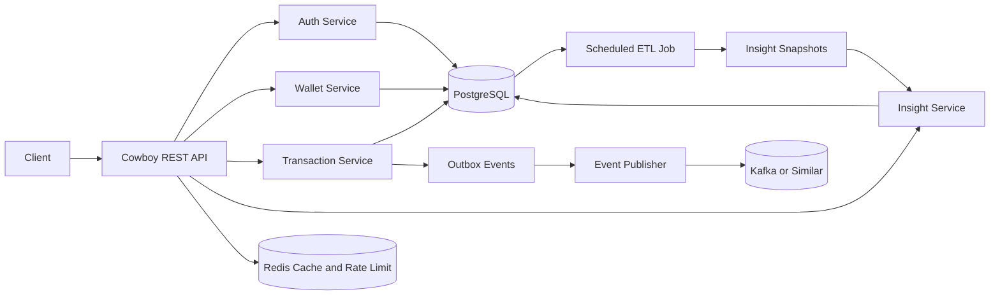

# Aurix Backend Design Document

## 1. Executive Summary

This document defines a production-oriented design for the Aurix backend: a multi-tenant fintech service for digital gold trading with an AI insight layer. The selected implementation style is pure Erlang/OTP with Cowboy for HTTP, PostgreSQL for transactional persistence, JWT authentication, tenant isolation through tenant_id-based logical separation, and a mocked LLM adapter for insight generation.

The design is intentionally built around four priorities:

1. Transaction integrity for buy and sell operations.
2. Clean OTP-style service boundaries that are easy to test.
3. Multi-tenant isolation from day one.
4. A clear path to scale through asynchronous processing, caching, and event-driven architecture.

## 2. Chosen Technical Direction

### Runtime and Platform

- Language: Erlang
- Runtime model: OTP supervision tree
- HTTP server: Cowboy
- Database: PostgreSQL
- Auth: Email/password with JWT (access token + refresh token)
- Password hashing: argon2id (preferred) or bcrypt as fallback
- Multi-tenancy: Shared schema with tenant_id on all tenant-owned tables
- Agent layer: Structured signal generation plus mocked LLM formatter
- Testing: EUnit for unit logic, Common Test for API and integration flows
- Delivery extras: Docker, rate limiting, OpenAPI, event-driven transaction logging

### Why this stack fits the task

Erlang/OTP is a strong fit for reliable backend services because it offers supervised processes, fault isolation, and predictable concurrency behavior. PostgreSQL is the right primary store for wallet and ledger operations because the assignment requires atomic transactions and correctness under concurrent updates.

## 3. Scope and Assumptions

### In Scope

- User registration and login
- JWT authentication
- Wallet creation per user
- Buy and sell gold
- Transaction history
- Multi-tenant isolation
- AI insights endpoint
- Scheduled ETL aggregation
- README-grade scaling explanation

### Assumptions

- Real banking rails are not part of this task.
- For demo purposes, each wallet may start with a seeded EUR balance such as 10,000.00 EUR.
- Gold pricing starts as fixed from configuration. The price provider is designed behind an interface so it can be swapped to a live market feed without changing service logic.
- Tenants are seeded through setup scripts or admin SQL and are referenced by tenant_code during registration and login.
- After login, authenticated endpoints derive tenant context from JWT claims only.
- Tenant creation is not required as an exposed endpoint.
- The intended deployment environment is Germany or the EU, so personal data handling must be designed with GDPR-compatible operational controls.
- If the controller is not established in the EU but offers services to users in Germany or elsewhere in the EU, GDPR still applies and an EU representative may be required unless an EU establishment already covers that role.
- Full regulatory implementation such as KYC, AML screening, sanctions checks, tax reporting, and BaFin-facing processes is outside the scope of this assignment, but the architecture should leave room for those integrations.

## 4. Architecture Principles

- Keep the synchronous write path minimal: validate, lock, update wallet, insert ledger record, insert outbox event, commit.
- Never use floating-point arithmetic for money-sensitive operations.
- Separate HTTP handlers from business services and repositories.
- Treat the transaction ledger as immutable audit history.
- Store current wallet balances for fast reads, then reconcile them against the ledger periodically.
- Put analytics and insight generation behind asynchronous jobs so buy and sell latency stays low.

## 5. High-Level Architecture



## 6. OTP Application Layout

The project can be implemented as one OTP release with clearly separated modules, or as multiple OTP apps under a rebar3 umbrella. For this assignment, one release with logical boundaries is enough.

### Suggested Logical Modules

- aurix_app: application startup
- aurix_sup: top-level supervisor
- aurix_http_sup: Cowboy listener supervision
- aurix_router: route definitions
- aurix_auth_handler: register and login endpoints
- aurix_wallet_handler: wallet, buy, sell endpoints
- aurix_transaction_handler: transaction listing endpoint
- aurix_insight_handler: insights endpoint
- aurix_auth_service: password and JWT logic
- aurix_wallet_service: wallet orchestration
- aurix_transaction_service: posting ledger entries and validations
- aurix_tenant_service: tenant resolution and validation
- aurix_price_provider: gold price source behind a behaviour interface (fixed, cached, or live)
- aurix_agent_service: insight generation facade
- aurix_etl_job: scheduled aggregation job
- aurix_repo_*: PostgreSQL repository modules
- aurix_outbox_dispatcher: background publisher for event-driven logging

### Supervision Tree

```text
aurix_sup
|- aurix_db_pool_sup
|- aurix_http_sup
|- aurix_price_provider
|- aurix_outbox_dispatcher
|- aurix_etl_scheduler
|- aurix_metrics
```

This keeps long-running system components supervised independently. A crash in the ETL scheduler or event publisher must not affect the HTTP listener.

## 7. Clean Service-Layer Architecture

### Handler Layer

- Parse HTTP requests
- Extract tenant and auth context
- Validate required fields at request level
- Call domain services
- Translate domain results into JSON responses and HTTP status codes

### Service Layer

- Enforce business rules
- Orchestrate repository calls
- Open and commit database transactions
- Apply pricing, validation, idempotency, and ledger logic

### Repository Layer

- Execute SQL only
- No business logic
- Expose functions for get, insert, update, list, and lock operations

This structure makes the code easier to test and easier to justify during review.

## 8. Multi-Tenant Design

### Chosen Implementation

The implemented model uses shared tables with tenant_id on all tenant-scoped records.

Benefits:

- Faster to deliver than schema-per-tenant
- Easier local development and migrations
- Simpler shared analytics and operational tooling

Required safety measures:

- Every tenant-owned table includes tenant_id
- Every repository query includes tenant_id in the WHERE clause
- JWT claims include tenant_id
- Authenticated requests derive tenant context from JWT claims only
- Composite indexes include tenant_id for query efficiency

### Conceptual Alternative: Schema Per Tenant

Schema-per-tenant provides stronger isolation and can be useful for regulated enterprise customers, but it adds migration, connection routing, and operational complexity. For this assignment, tenant_id-based separation is the correct implementation choice, while schema-based isolation can be described as a future upgrade path.

### Hardening Option

PostgreSQL Row-Level Security can be added later for defense in depth, but application-level tenant scoping remains mandatory.

## 9. Data Model

### Core Entities

- tenants
- users
- wallets
- transactions
- insight_snapshots
- outbox_events

### Recommended PostgreSQL Schema

```sql
create table tenants (
		id uuid primary key,
		code varchar(64) not null unique,
		name varchar(255) not null,
		status varchar(32) not null default 'active',
		created_at timestamptz not null default now()
);

create table users (
		id uuid primary key,
		tenant_id uuid not null references tenants(id),
		email varchar(255) not null,
		password_hash text not null,
		status varchar(32) not null default 'active',
		deleted_at timestamptz,
		created_at timestamptz not null default now(),
		unique (tenant_id, email)
);

create table wallets (
		id uuid primary key,
		tenant_id uuid not null references tenants(id),
		user_id uuid not null references users(id),
		gold_balance_grams numeric(24, 8) not null default 0,
		fiat_balance_eur_cents bigint not null default 0,
		version bigint not null default 0,
		created_at timestamptz not null default now(),
		updated_at timestamptz not null default now(),
		unique (tenant_id, user_id)
);

create table transactions (
		id uuid primary key,
		tenant_id uuid not null references tenants(id),
		wallet_id uuid not null references wallets(id),
		user_id uuid not null references users(id),
		type varchar(16) not null check (type in ('buy', 'sell')),
		gold_grams numeric(24, 8) not null,
		price_eur_per_gram numeric(24, 8) not null,
		gross_eur_cents bigint not null,
		fee_eur_cents bigint not null default 0,
		status varchar(16) not null default 'posted',
		idempotency_key varchar(128) not null,
		metadata jsonb,
		created_at timestamptz not null default now(),
		unique (tenant_id, idempotency_key)
);

create table insight_snapshots (
		id uuid primary key,
		tenant_id uuid not null references tenants(id),
		user_id uuid not null references users(id),
		frequency varchar(16) not null check (frequency in ('daily', 'weekly')),
		period_start date not null,
		period_end date not null,
		summary jsonb not null,
		created_at timestamptz not null default now(),
		unique (tenant_id, user_id, frequency, period_start, period_end)
);

create table outbox_events (
		id bigserial primary key,
		tenant_id uuid not null,
		aggregate_type varchar(64) not null,
		aggregate_id uuid not null,
		event_type varchar(64) not null,
		payload jsonb not null,
		published_at timestamptz,
		created_at timestamptz not null default now()
);

create index idx_users_tenant_email on users (tenant_id, email);
create index idx_wallets_tenant_user on wallets (tenant_id, user_id);
create index idx_transactions_tenant_wallet_time on transactions (tenant_id, wallet_id, created_at desc);
create index idx_insights_tenant_user_period on insight_snapshots (tenant_id, user_id, frequency, period_end desc);
create index idx_outbox_unpublished on outbox_events (published_at) where published_at is null;
```

### Data Integrity Notes

- EUR is stored as integer cents.
- Gold is stored as numeric with fixed scale.
- No floating point operations are allowed in wallet computations.
- Ledger rows are append-only.
- Wallet rows keep current balances for fast reads.
- Users have a deleted_at column for soft delete. When set, the user is treated as inactive: login is rejected, wallet operations are blocked, and the record is excluded from normal queries. Hard deletion of personal data follows the GDPR erasure workflow after retention obligations expire.

## 10. Authentication and Authorization

### Registration

Input:

- tenant_code
- email
- password

Flow:

1. Resolve tenant by tenant_code.
2. Validate email uniqueness within tenant.
3. Hash password.
4. Create user.
5. Create wallet.
6. Seed initial fiat balance for demo if enabled.

### Login

Input:

- tenant_code
- email
- password

Response:

- JWT access token (short-lived, 15 minutes)
- Refresh token (long-lived, 7 days)

### JWT Claims

```json
{
	"sub": "user-uuid",
	"tenant_id": "tenant-uuid",
	"email": "user@example.com",
	"exp": 1770000000
}
```

### Token Refresh

Clients send an expired or near-expiry access token along with a valid refresh token to POST /auth/refresh. The server validates the refresh token, issues a new access token, and optionally rotates the refresh token. Refresh tokens are stored as hashed values in a dedicated table and can be revoked per user or per session.

```sql
create table refresh_tokens (
		id uuid primary key,
		tenant_id uuid not null references tenants(id),
		user_id uuid not null references users(id),
		token_hash text not null,
		expires_at timestamptz not null,
		revoked_at timestamptz,
		created_at timestamptz not null default now()
);

create index idx_refresh_tokens_user on refresh_tokens (tenant_id, user_id) where revoked_at is null;
```

### Password Hashing

Passwords are hashed using argon2id with the following parameters as a baseline:

- Memory: 64 MiB
- Iterations: 3
- Parallelism: 1

If the runtime environment does not support argon2id via a NIF binding, bcrypt with a cost factor of 12 is the fallback. The password_hash column stores the algorithm identifier as part of the hash string so the system can verify old hashes and rehash on login when migrating between algorithms.

For authenticated endpoints, tenant_id is taken exclusively from the validated JWT claims. Public endpoints such as register and login accept tenant_code in the request body to resolve the tenant before token issuance.

## 11. Wallet Transaction Logic

### Buy Gold

Request fields:

- grams
- optional idempotency_key

Validation:

- grams must be positive
- grams must respect allowed precision
- wallet must exist under the authenticated tenant and user
- fiat balance must be sufficient for quoted total

Transaction flow:

1. Begin database transaction.
2. Lock wallet row with SELECT ... FOR UPDATE.
3. Read current gold price from aurix_price_provider.
4. Compute gross amount: `gross_eur_cents = round(grams * price_eur_per_gram * 100)`.
5. Compute fee: `fee_eur_cents = max(min_fee, round(gross_eur_cents * fee_rate))` where fee_rate and min_fee are tenant-level configuration.
6. Compute total debit: `total_eur_cents = gross_eur_cents + fee_eur_cents`.
7. Validate available fiat balance >= total_eur_cents.
8. Update wallet balances (debit fiat by total_eur_cents, credit gold by grams).
9. Insert immutable transaction record with gross_eur_cents and fee_eur_cents.
10. Insert outbox event.
11. Commit.

### Sell Gold

Validation:

- grams must be positive
- user must own enough gold

Transaction flow mirrors buy, except the wallet loses gold and gains fiat. For sell operations, the fee is deducted from the fiat proceeds: `net_eur_cents = gross_eur_cents - fee_eur_cents`.

### Atomicity Strategy

Atomicity is guaranteed by a single PostgreSQL transaction around wallet update, ledger insert, and outbox insert. If any step fails, the entire transaction rolls back.

### Idempotency

Write endpoints should accept an Idempotency-Key header or request field. The unique constraint on (tenant_id, idempotency_key) prevents duplicate posting when clients retry.

### Auditability

The wallet table provides current balances for fast reads. The transactions table is the audit trail. A periodic reconciliation job can recompute balances from the ledger and compare them to wallet rows.

## 12. AI / Agent Layer

### Goal

The agent analyzes user transaction behavior and returns actionable insights such as:

- You are buying frequently at higher-than-average prices.
- Consider averaging your purchases over time.
- Your sell behavior is concentrated shortly after buys.

### Chosen Implementation

Use a two-step design:

1. Structured signal generation from transaction history.
2. Mocked LLM-style formatter that converts signals into natural language.

This is stronger than a raw rules-only solution because it shows AI architecture while avoiding external runtime dependency.

### Example Signals

- average_buy_price_vs_reference
- buy_frequency_per_week
- sell_after_buy_ratio
- inactivity_days
- concentration_on_peak_price_windows

### Insight Generation Flow

1. Fetch latest daily or weekly aggregates for the user.
2. Build a structured summary.
3. Pass summary into a mocked llm_adapter module.
4. Return natural-language recommendations and supporting metrics.

The insights are advisory only. They must not be used as the sole automated basis for decisions that produce legal or similarly significant effects for the user.

### GET /insights Response Example

```json
{
	"items": [
		{
			"tenant_id": "tenant-uuid",
			"user_id": "user-uuid",
			"frequency": "weekly",
			"generated_at": "2026-04-02T14:15:00Z",
			"signals": {
				"buy_frequency_per_week": 4,
				"average_buy_price_eur_per_gram": "68.12",
				"reference_price_eur_per_gram": "64.90"
			},
			"insights": [
				"You are buying frequently at prices above your weekly reference average.",
				"Consider averaging your purchases across multiple days instead of clustering them."
			]
		}
	],
	"next_cursor": "opaque-cursor"
}
```

The /insights endpoint supports cursor-based pagination with the same pattern used by /transactions. Clients pass `?cursor=<opaque-cursor>&limit=10` to page through historical insight snapshots.

## 13. ETL / Data Pipeline Design

### Objective

Build a lightweight batch pipeline that extracts transaction history, transforms it into daily or weekly aggregates, and loads summarized insight records.

### ETL Steps

Extract:

- Pull posted transactions since the last processed watermark.

Transform:

- Group by tenant_id, user_id, and day or week.
- Compute counts, volumes, average buy price, average sell price, and behavioral flags.

Load:

- Upsert into insight_snapshots.

### Implementation Style in OTP

- aurix_etl_scheduler runs on a timer or cron-like interval.
- aurix_etl_job processes batches in a controlled loop.
- Watermark state is stored in PostgreSQL or a dedicated metadata table.
- Upserts make reruns safe and idempotent.

This is enough to satisfy the assignment while keeping the door open for future migration to Kafka consumers or a dedicated analytics pipeline.

## 14. API Design

### Required Endpoints

- POST /auth/register
- POST /auth/login
- POST /auth/refresh
- GET /wallet
- POST /wallet/buy
- POST /wallet/sell
- GET /transactions
- GET /insights

### Recommended Privacy Endpoints For Germany or EU Deployment

- GET /privacy/export
- POST /privacy/erasure-request

These are not mandatory for the time-boxed assignment, but they are recommended for production readiness when serving users in Germany or the wider EU.

### Register Example

```http
POST /auth/register
Content-Type: application/json

{
	"tenant_code": "aurix-demo",
	"email": "user@example.com",
	"password": "StrongPass123"
}
```

### Login Example

```http
POST /auth/login
Content-Type: application/json

{
	"tenant_code": "aurix-demo",
	"email": "user@example.com",
	"password": "StrongPass123"
}
```

### Wallet Response Example

```json
{
	"wallet_id": "wallet-uuid",
	"tenant_id": "tenant-uuid",
	"user_id": "user-uuid",
	"gold_balance_grams": "12.50000000",
	"fiat_balance_eur": "8421.35"
}
```

### Buy Request Example

```http
POST /wallet/buy
Authorization: Bearer <jwt>
Idempotency-Key: 2e7b3d0e-buy-001
Content-Type: application/json

{
	"grams": "1.25000000"
}
```

### Sell Request Example

```http
POST /wallet/sell
Authorization: Bearer <jwt>
Idempotency-Key: 2e7b3d0e-sell-001
Content-Type: application/json

{
	"grams": "0.50000000"
}
```

### Transactions Response Example

```json
{
	"items": [
		{
			"id": "tx-uuid-1",
			"type": "buy",
			"gold_grams": "1.25000000",
			"price_eur_per_gram": "65.00",
			"gross_eur": "81.25",
			"created_at": "2026-04-02T10:00:00Z"
		}
	],
	"next_cursor": "opaque-cursor"
}
```

### REST Notes

- Use proper status codes: 200, 201, 400, 401, 403, 404, 409, 422.
- Use cursor pagination on /transactions and /insights.
- Authenticated endpoints resolve tenant scope from JWT claims, not from a separate tenant header or path parameter.
- Return machine-readable error codes in JSON.

### Fee Schedule

Fees are configured per tenant and stored in a tenant_fee_config table or as part of tenant metadata. The default fee model is a percentage of the gross transaction amount with an optional minimum floor:

- buy_fee_rate: 0.5% of gross EUR amount (default)
- sell_fee_rate: 0.5% of gross EUR amount (default)
- min_fee_eur_cents: 50 (minimum 0.50 EUR per transaction)

The fee is always computed in integer cents: `fee_eur_cents = max(min_fee_eur_cents, round(gross_eur_cents * fee_rate))`. Fee rates can be overridden per tenant without code changes.

### Price Provider Design

The aurix_price_provider module implements a behaviour with a single callback `get_price/1` that returns the current EUR-per-gram price. Three implementations are planned:

1. **aurix_price_fixed**: Returns a static price from application config. Used for tests and demo.
2. **aurix_price_cached**: Wraps a live source and caches the result in Redis with a configurable TTL (default 60 seconds). Falls back to the last known price if the upstream is unavailable.
3. **aurix_price_live**: Fetches from an external market data API. Not implemented in the first version but the interface is ready.

The active provider is selected through application config and can be changed per environment without redeployment.

## 15. Validation Rules

- Email must be valid and normalized.
- Password must be at least 10 characters, contain at least one uppercase letter, one lowercase letter, and one digit. No maximum length below 128 characters.
- grams must be a decimal string with accepted precision.
- Buy must fail if fiat is insufficient.
- Sell must fail if gold is insufficient.
- Tenant mismatch must always fail.
- Replayed idempotency keys must return the original successful response or a conflict-safe equivalent.

## 16. Rate Limiting

Rate limiting is part of the bonus scope and is worth implementing.

Recommended rules:

- Login endpoints: strict limits per IP and tenant
- Buy and sell endpoints: per user and per tenant
- Insights endpoint: softer read limits

Implementation options:

- Local ETS token bucket for simple demo mode
- Redis-based counters for horizontally scaled deployments

Redis is the better production choice because API instances will scale horizontally.

## 17. Event-Driven Transaction Logging

### Why it matters

Transactions should not only be stored in PostgreSQL. They should also be published as domain events for analytics, auditing, or notification consumers.

### Safe Pattern

Use the outbox pattern:

1. Insert the transaction row and outbox row in the same database transaction.
2. A background dispatcher reads unpublished outbox rows.
3. The dispatcher publishes to Kafka or another message broker.
4. The row is marked as published.

This avoids the classic problem where the database commit succeeds but message publication fails.

### Example Event Types

- wallet.buy.posted
- wallet.sell.posted
- wallet.balance.updated

## 18. OpenAPI / Swagger

This bonus should be included because it is easy to evaluate and improves submission quality.

Recommended approach:

- Maintain an openapi.yaml file in the repository.
- Document request and response models for all endpoints.
- Optionally serve Swagger UI as static content or provide the YAML file and setup instructions.

## 19. Testing Strategy

### EUnit

Use EUnit for pure business logic and validation:

- price calculation
- insufficient balance validation
- tenant guard logic
- insight signal generation
- JWT claim parsing

### Common Test

Use Common Test for integration flows:

- register and login
- create wallet on registration
- buy gold transaction success
- sell gold transaction success
- duplicate idempotency key handling
- cross-tenant access rejection
- ETL job creating insight snapshots

### Test Data Strategy

- One tenant with multiple users
- Two tenants to verify isolation
- Seeded wallet balances for deterministic buy flows

## 20. Scalability Plan for Millions of Users

### API Tier

- Run stateless Cowboy API nodes behind a load balancer.
- Keep JWT verification local so auth lookups are minimized.
- Move expensive analytics and notifications off the write path.

### Database Tier

- Use PostgreSQL primary for writes and replicas for read-heavy endpoints.
- Partition transactions by time and possibly by tenant_id for very large scale.
- Add composite indexes that start with tenant_id.
- Introduce sharding only when one primary can no longer meet write volume or storage needs.

### Concurrency and Consistency

- Use row-level locking on wallet rows for write operations.
- Use idempotency keys to make retries safe.
- Keep wallet updates and ledger writes in the same transaction.
- Add reconciliation jobs to detect divergence between balances and ledger sums.

### Caching with Redis

- Cache fixed or market price data.
- Cache recent insights for read-heavy clients.
- Store distributed rate limit counters.
- Avoid caching authoritative wallet balances during writes.

### Messaging with Kafka

- Publish transaction events asynchronously.
- Feed downstream consumers such as analytics, notifications, and audit services.
- Decouple ETL from the main wallet service over time.

## 21. Deployment and DevOps

### Local Development

Use Docker Compose with:

- aurix-app
- postgres
- redis (required for rate limiting and price caching)

Optional:

- kafka
- swagger-ui

### Cloud Deployment

Recommended options:

- Containerized OTP release on Kubernetes or ECS
- Managed PostgreSQL
- Managed Redis
- Managed Kafka or compatible event platform

### CI/CD Pipeline

1. Run formatting and static checks.
2. Run EUnit.
3. Run Common Test.
4. Build OTP release.
5. Build Docker image.
6. Run migration step.
7. Deploy to staging, then production.

### Observability

- Structured JSON logs with request_id, tenant_id, user_id, and transaction_id
- Never log raw passwords, JWTs, or full personal data fields when pseudonymous identifiers are sufficient
- Metrics for latency, error rates, transaction volume, and ETL lag
- OpenTelemetry traces for HTTP, database, and outbox flows

## 22. Recommended Repository Structure

```text
aurix/
|- apps/
|  |- aurix/
|     |- src/
|     |- test/
|- config/
|- priv/
|  |- sql/
|  |- openapi/
|- docker/
|- README.md
|- docker-compose.yml
|- rebar.config
```

## 23. Submission Checklist

- GitHub repository with clean structure
- README with setup, architecture, and scaling notes
- SQL schema and migration instructions
- API examples
- Tests
- Docker instructions
- OpenAPI file
- Explanation of multi-tenant strategy and future schema-based alternative

## 24. GDPR and Germany or EU Privacy Readiness

### Why it matters

If Aurix is offered to users in Germany or elsewhere in the EU, the platform must support GDPR-compatible personal data handling even if parts of the engineering team, support team, or vendor stack are outside the EU.

### User rights that should be supported

- Clear privacy notice explaining processing purposes, legal bases, retention periods, recipients, and any cross-border transfers
- Right of access to personal data and a downloadable copy in a structured, commonly used, machine-readable format
- Right to rectification of inaccurate or incomplete profile data
- Right to erasure where deletion is legally permissible
- Right to restriction of processing or objection where applicable
- Right to lodge a complaint with the competent supervisory authority

### Request handling workflow

- Provide a self-service or support-assisted workflow for privacy requests
- Verify the requester's identity before exporting or erasing personal data
- Respond without undue delay and normally within one month
- Record request receipt, identity verification, decision, and completion timestamp for auditability

### Download and portability design

- GET /privacy/export should provide a secure export that supports access requests and, where applicable, portability requests
- The export package should include core profile data, wallet state, transaction history, and insight records linked to the user
- JSON should be the default machine-readable format, with optional CSV export for transaction history
- Large exports should be generated asynchronously and delivered through an expiring download link

### Deletion and account closure design

- User deletion must be treated as a controlled erasure workflow, not as blind hard deletion of every row
- Once an erasure request is accepted, the system should disable login and new trading activity immediately
- Non-essential profile data should be erased or pseudonymised when no longer required for the original purpose
- Transaction ledgers, invoices, security logs, and records needed for legal obligations, accounting, fraud prevention, audit, or the defence of legal claims may need to be retained
- Where full erasure is not legally possible, the account should be marked closed, processing should be restricted, and access to retained records should be tightly limited

### Legal basis and processing boundaries

- Core registration, authentication, wallet operations, and transaction processing should rely on a documented legal basis such as contract performance and legal obligation where applicable
- Optional marketing or non-essential analytics should not be bundled into the core service without a separate lawful basis where required
- AI insights should be positioned as advisory recommendations, not binding automated decisions

### Data minimisation, retention, and transfers

- Store only the personal data required for account operation, security, and regulatory obligations
- Define retention windows per data category instead of keeping all personal data indefinitely
- Pseudonymise or anonymise ETL and analytics datasets where feasible
- Prefer EU-hosted infrastructure for primary production data
- If processors or infrastructure outside the EU are used, ensure a valid GDPR transfer mechanism is in place before personal data leaves the EU

### Security and governance expectations

- Encrypt personal data in transit and at rest
- Maintain processor agreements, records of processing activities, and an internal breach-response procedure
- Notify the competent supervisory authority within the required GDPR window when a reportable personal data breach occurs, and notify affected users when the breach creates a high risk to their rights and freedoms
- Appoint a Data Protection Officer when the operating model or scale of processing requires it
- Carry out a DPIA before introducing high-risk profiling or automated decision-making features

## 25. Germany Production Readiness

### Regulatory perimeter and licensing

- Obtain a written legal and regulatory assessment before go-live
- BaFin treats fintechs under the principle of same business, same risks, same rules, so the label fintech does not reduce regulatory obligations
- Depending on the final product shape, assess whether the service triggers authorisation or registration requirements under German or EU financial services rules
- If Aurix operates only as a technical provider to a licensed institution, document the allocation of regulatory responsibilities contractually and operationally
- Engage BaFin early if the business model is novel or sits near an authorisation boundary

### AML, fraud, and transaction monitoring

- If the operating model falls within an obliged-entity perimeter, implement a GwG-aligned AML and CFT programme before launch
- Maintain formal business policies, a written risk analysis, and internal risk measures proportionate to the product
- Perform customer due diligence, beneficial-owner checks, and PEP or sanctions screening where applicable
- Capture the purpose and nature of the business relationship and continuously monitor transactions for unusual behaviour
- Provide case management, manual review, account restrictions, and suspicious activity escalation paths, including reporting to the FIU where legally required

### DORA, NIS2, and operational resilience

- If Aurix is operated by an in-scope regulated financial entity, assess DORA applicability as a first-class production requirement
- DORA requires governance accountability, ICT risk management, incident handling and reporting, resilience testing, business continuity, backup and recovery capability, and ICT third-party risk control
- Maintain a register of ICT third-party providers, assess concentration risk, and ensure exit strategies and audit rights exist in critical contracts
- If DORA does not apply, assess whether NIS2 or other German cybersecurity obligations apply based on the final entity type and operating scale
- Follow BSI security advisories and maintain a documented incident response and crisis communication process

### Security operations and infrastructure

- Run production with centralised audit logging, alerting, and a 24 by 7 or clearly defined on-call incident response model
- Enforce MFA for all administrative access and use managed secrets storage backed by strong key management controls
- Define patch SLAs, vulnerability management, dependency scanning, and regular external penetration testing
- Test backup restoration and disaster recovery on a schedule, not only on paper
- Prefer EU-hosted primary production systems and keep an inventory of all subprocessors and infrastructure regions

### Financial control environment

- Reconcile wallet balances, transactions, and any external settlement records daily
- Apply dual control to price changes, fee changes, refunds, and privileged back-office actions
- Separate duties across engineering, operations, finance, and customer support for sensitive workflows
- Retain tamper-evident audit trails for balance-affecting actions and administrative overrides

### Customer, legal, and language operations

- Publish a privacy notice, terms of service, retention summary, and complaint handling channel before public launch
- Ensure customer communications around outages, incidents, fees, and AI insights are clear and non-misleading
- Position the insights layer as informational support, not regulated investment advice or fully automated decision-making
- Provide German-language customer and privacy workflows if Germany is a target market rather than only a back-office operating location

## 26. Final Recommendation

For this assignment, the strongest submission is not the most complex one. The strongest submission is the one that clearly proves sound backend engineering decisions. The implementation should focus on correctness first: tenant isolation, atomic wallet operations, immutable ledger records, idempotent write endpoints, and a clean OTP architecture. The AI layer should remain simple but credible through structured signals and a mocked LLM formatter. The scaling section should explain how the current design evolves into Redis, Kafka, read replicas, partitioning, and containerized deployment without changing the core domain model.

This gives a submission that is realistic, technically defensible, and aligned with the evaluation criteria.


the massage task {

Dear Ibrahim,

Thank you for sharing your background. Given your experience with backend systems, multi-tenant architectures, AI integration, and cloud environments, your evaluation task is designed to test system design depth, scalability, and real-world engineering thinking.

⸻

Task Title: Design & Build a Scalable AI-Enabled Aurix Backend (Gold Wallet + Agent Layer)

⸻

Objective
This task evaluates your ability to:
	•	Design production-grade backend systems
	•	Handle multi-tenant architecture
	•	Implement reliable financial transaction logic
	•	Integrate AI/agent-based workflows
	•	Think in terms of scalability and system boundaries

Aurix is a fintech platform for digital gold transactions and intelligent financial insights.

⸻

Time Limit
24 hours

⸻

Task Requirements

Part 1: Core Wallet Service (Mandatory)

Build a backend service that supports:
	•	User registration and authentication (JWT)
	•	Wallet creation per user
	•	Gold balance (grams) + fiat balance (EUR)

Operations:
	•	Buy gold
	•	Sell gold

Requirements:
	•	Strong validation
	•	Atomic transactions
	•	Clean service-layer architecture

⸻

Part 2: Multi-Tenant Design

Design your system to support multiple organizations (tenants).

Each tenant should have:
	•	Isolated users
	•	Isolated wallets
	•	Logical data separation

You may implement:
	•	Tenant ID-based separation
	•	Or schema-based (conceptual explanation is enough)

⸻

Part 3: AI / Agent Layer

Design a simple AI agent module that:
	•	Analyzes user transactions
	•	Generates insights such as:
	•	“You are buying frequently at peak prices”
	•	“Consider averaging your purchases”

Implementation options:
	•	Rule-based agent
	•	Or LLM-based integration (mocked is fine)

Expose via endpoint:

GET /insights

⸻

Part 4: ETL / Data Pipeline Thinking

Simulate a small pipeline:
	•	Extract: transaction data
	•	Transform: aggregate user activity (daily/weekly)
	•	Load: store summarized insights

You can implement this as:
	•	A scheduled script
	•	Or a simple batch function

⸻

Part 5: System Design & Scaling

In your README, explain:
	•	How to scale this system to millions of users
	•	How to handle:
	•	High concurrency transactions
	•	Data consistency
	•	Caching (Redis)
	•	Message queues (Kafka or similar)
	•	Deployment approach (Docker, cloud, CI/CD)

⸻

Part 6: API Design

Expose clean endpoints such as:
	•	/auth/register
	•	/auth/login
	•	/wallet
	•	/wallet/buy
	•	/wallet/sell
	•	/transactions
	•	/insights

Follow proper REST design principles.

⸻

Bonus (Strong Signal)

If time allows:
	•	Dockerize the application
	•	Add rate limiting
	•	Add unit tests
	•	Implement event-driven transaction logging
	•	Add OpenAPI/Swagger docs

⸻

Deliverables

Please submit:
	•	GitHub repository
	•	README file
	•	Architecture explanation
	•	Setup instructions
	•	Sample API responses

⸻

Evaluation Focus

We will evaluate:
	•	System design maturity
	•	Backend architecture quality
	•	Transaction integrity
	•	Multi-tenant handling
	•	AI integration thinking
	•	Code clarity and modularity
	•	Scalability mindset

⸻

This task is intentionally aligned with real production-level challenges, reflecting the type of work you may handle during the internship.

We look forward to reviewing your solution.

Best regards,
Prof. Dr. Ahmed Ebada

}