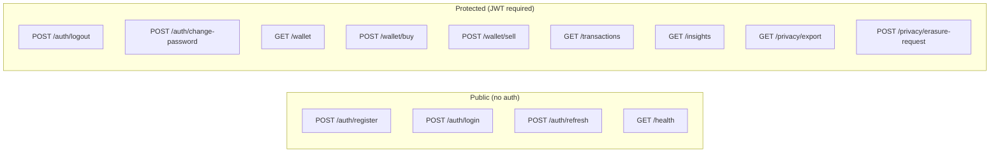
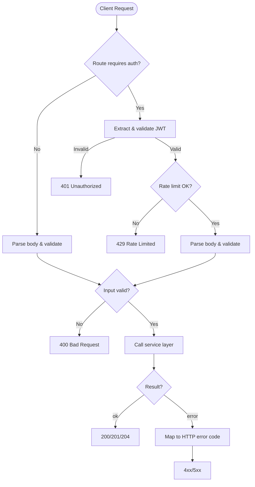

# Aurix — API Design

## Base URL

```
http://localhost:8080
```

## Common Headers

| Header | Required | Description |
|--------|----------|-------------|
| `Content-Type` | Yes (on POST/PUT) | `application/json` |
| `Authorization` | Yes (protected routes) | `Bearer <jwt_access_token>` |
| `Idempotency-Key` | Recommended (write ops) | Unique key to prevent duplicate processing |
| `X-Request-Id` | Optional | Client-provided request correlation ID |

## Standard Error Response

All error responses follow this structure:

```json
{
    "error": {
        "code": "error_code_snake_case",
        "message": "Human-readable description",
        "details": {}
    }
}
```

### Error Codes

| HTTP Status | Code | Description |
|-------------|------|-------------|
| 400 | `bad_request` | Malformed request body |
| 400 | `invalid_email` | Email format is invalid |
| 400 | `invalid_password` | Password doesn't meet requirements |
| 400 | `invalid_amount` | Grams value is invalid |
| 400 | `invalid_tenant` | Tenant code not found |
| 401 | `unauthorized` | Missing or invalid JWT |
| 401 | `invalid_credentials` | Wrong email or password |
| 401 | `token_expired` | JWT or refresh token expired |
| 401 | `token_revoked` | Refresh token was revoked |
| 403 | `account_disabled` | User account is soft-deleted |
| 403 | `tenant_inactive` | Tenant is deactivated |
| 404 | `not_found` | Resource does not exist |
| 404 | `wallet_not_found` | No wallet for this user |
| 409 | `email_taken` | Email already registered in tenant |
| 409 | `duplicate_request` | Idempotency key already used |
| 422 | `insufficient_balance` | Not enough EUR for this purchase |
| 422 | `insufficient_gold` | Not enough gold for this sale |
| 429 | `rate_limited` | Too many requests |
| 500 | `internal_error` | Unexpected server error |

---

## Pagination

All list endpoints use **cursor-based pagination**.

### Query Parameters

| Param | Type | Default | Description |
|-------|------|---------|-------------|
| `cursor` | string | (none) | Opaque cursor from `next_cursor` |
| `limit` | integer | 20 | Items per page (max 100) |

### Response Envelope

```json
{
    "items": [],
    "next_cursor": "opaque-cursor-string-or-null"
}
```

`next_cursor` is `null` when there are no more pages.

### Cursor Encoding

Cursors are opaque to clients but internally encoded as:

```
base64url(json({"created_at": "<ISO8601>", "id": "<uuid>"}))
```

**Example:**
```
eyJjcmVhdGVkX2F0IjoiMjAyNi0wNC0wMlQxMDowMDowMFoiLCJpZCI6Ijg4MGU4NDAwLWUyOWItNDFkNC1hNzE2LTQ0NjY1NTQ0MDAwMCJ9
```

**Server-side query pattern:**
```sql
WHERE tenant_id = $tenant_id
  AND user_id = $user_id
  AND (created_at, id) < ($cursor_created_at, $cursor_id)
ORDER BY created_at DESC, id DESC
LIMIT $limit + 1
```

The server fetches `limit + 1` rows. If `limit + 1` rows are returned, slice the result to `limit` and build `next_cursor` from the last included row. Otherwise, `next_cursor` is `null`.

---

## Endpoints Overview



---

## Authentication Endpoints

### POST /auth/register

Create a new user account and wallet.

**Request:**
```json
{
    "tenant_code": "aurix-demo",
    "email": "user@example.com",
    "password": "StrongPass123"
}
```

**Validation:**
- `tenant_code`: required, must match an active tenant
- `email`: required, valid email format, unique within tenant
- `password`: required, >= 10 chars, 1 uppercase, 1 lowercase, 1 digit

**Response 201:**
```json
{
    "user_id": "550e8400-e29b-41d4-a716-446655440000",
    "email": "user@example.com",
    "tenant_id": "660e8400-e29b-41d4-a716-446655440000",
    "wallet_id": "770e8400-e29b-41d4-a716-446655440000",
    "created_at": "2026-04-02T10:00:00Z"
}
```

**Errors:** `400 invalid_tenant`, `400 invalid_email`, `400 invalid_password`, `409 email_taken`, `403 tenant_inactive`

---

### POST /auth/login

Authenticate and receive tokens.

**Request:**
```json
{
    "tenant_code": "aurix-demo",
    "email": "user@example.com",
    "password": "StrongPass123"
}
```

**Response 200:**
```json
{
    "access_token": "eyJhbGciOiJIUzI1NiIs...",
    "refresh_token": "dGhpcyBpcyBhIHJlZnJlc2g...",
    "token_type": "Bearer",
    "expires_in": 900
}
```

**Errors:** `400 invalid_tenant`, `401 invalid_credentials`, `403 account_disabled`, `403 tenant_inactive`

---

### POST /auth/refresh

Exchange a refresh token for a new access token.

**Request:**
```json
{
    "refresh_token": "dGhpcyBpcyBhIHJlZnJlc2g..."
}
```

**Response 200:**
```json
{
    "access_token": "eyJhbGciOiJIUzI1NiIs...",
    "refresh_token": "bmV3IHJlZnJlc2ggdG9rZW4...",
    "token_type": "Bearer",
    "expires_in": 900
}
```

**Errors:** `401 token_expired`, `401 token_revoked`, `403 account_disabled`

---

### POST /auth/logout

Revoke the current refresh token. **Requires JWT.**

**Request:**
```json
{
    "refresh_token": "dGhpcyBpcyBhIHJlZnJlc2g..."
}
```

**Response 204:** No content.

**Errors:** `401 unauthorized`

---

### POST /auth/change-password

Change the authenticated user's password. **Requires JWT.**

**Request:**
```json
{
    "current_password": "OldStrongPass123",
    "new_password": "NewStrongPass456"
}
```

**Validation:**
- `current_password`: required, must match stored password
- `new_password`: required, >= 10 chars, 1 uppercase, 1 lowercase, 1 digit
- `new_password` must differ from `current_password`

**Response 204:** No content.

**Side effects:**
- All existing refresh tokens for the user are revoked
- Client must re-authenticate with the new password

**Errors:** `400 invalid_password`, `401 unauthorized`, `401 invalid_credentials`

---

## Wallet Endpoints

### GET /wallet

Get the authenticated user's wallet. **Requires JWT.**

**Response 200:**
```json
{
    "wallet_id": "770e8400-e29b-41d4-a716-446655440000",
    "tenant_id": "660e8400-e29b-41d4-a716-446655440000",
    "user_id": "550e8400-e29b-41d4-a716-446655440000",
    "gold_balance_grams": "12.50000000",
    "fiat_balance_eur": "8421.35",
    "updated_at": "2026-04-02T10:30:00Z"
}
```

**Note:** `fiat_balance_eur` is stored as integer cents internally but returned as a decimal string for display.

**Errors:** `401 unauthorized`, `404 wallet_not_found`

---

### POST /wallet/buy

Buy gold with EUR balance. **Requires JWT.**

**Headers:**
```
Idempotency-Key: 2e7b3d0e-buy-001
```

**Request:**
```json
{
    "grams": "1.25000000"
}
```

**Validation:**
- `grams`: required, positive decimal string, max 8 decimal places
- Sufficient EUR balance for gross + fee

**Response 200:**
```json
{
    "transaction": {
        "id": "880e8400-e29b-41d4-a716-446655440000",
        "type": "buy",
        "gold_grams": "1.25000000",
        "price_eur_per_gram": "65.00000000",
        "gross_eur": "81.25",
        "fee_eur": "0.50",
        "total_eur": "81.75",
        "created_at": "2026-04-02T10:00:00Z"
    },
    "wallet": {
        "gold_balance_grams": "13.75000000",
        "fiat_balance_eur": "8339.60"
    }
}
```

> **Why 200 instead of 201?** Buy and sell endpoints return both the created transaction and the updated wallet state. The response represents the result of a processing action rather than solely a resource creation. 200 is used consistently for both buy and sell.
```

**Fee Calculation:**
```
gross_eur_cents = round(grams * price_per_gram * 100)
fee_eur_cents   = max(min_fee_cents, round(gross_eur_cents * fee_rate))
total_eur_cents = gross_eur_cents + fee_eur_cents
```

**Note:** `total_eur` (buy) and `net_eur` (sell) are **computed at read time** from `gross_eur_cents` and `fee_eur_cents` stored in the `transactions` table. They are not stored as separate columns. All EUR values in the response are converted from integer cents to decimal strings (e.g., `8125` → `"81.25"`).

**Errors:** `400 invalid_amount`, `401 unauthorized`, `409 duplicate_request`, `422 insufficient_balance`

---

### POST /wallet/sell

Sell gold for EUR balance. **Requires JWT.**

**Headers:**
```
Idempotency-Key: 2e7b3d0e-sell-001
```

**Request:**
```json
{
    "grams": "0.50000000"
}
```

**Response 200:**
```json
{
    "transaction": {
        "id": "990e8400-e29b-41d4-a716-446655440000",
        "type": "sell",
        "gold_grams": "0.50000000",
        "price_eur_per_gram": "65.00000000",
        "gross_eur": "32.50",
        "fee_eur": "0.50",
        "net_eur": "32.00",
        "created_at": "2026-04-02T10:05:00Z"
    },
    "wallet": {
        "gold_balance_grams": "13.25000000",
        "fiat_balance_eur": "8371.60"
    }
}
```

**Fee Calculation (sell):**
```
gross_eur_cents = round(grams * price_per_gram * 100)
fee_eur_cents   = max(min_fee_cents, round(gross_eur_cents * fee_rate))
net_eur_cents   = gross_eur_cents - fee_eur_cents
```

**Note:** `net_eur` is computed at read time. See buy endpoint note for details.

**Errors:** `400 invalid_amount`, `401 unauthorized`, `409 duplicate_request`, `422 insufficient_gold`

---

## Transaction Endpoints

### GET /transactions

List the user's transaction history. **Requires JWT.**

**Query Parameters:**

| Param | Type | Default | Description |
|-------|------|---------|-------------|
| `cursor` | string | — | Pagination cursor |
| `limit` | integer | 20 | Items per page (1–100) |
| `type` | string | — | Filter: `buy` or `sell` |

**Response 200:**
```json
{
    "items": [
        {
            "id": "880e8400-e29b-41d4-a716-446655440000",
            "type": "buy",
            "gold_grams": "1.25000000",
            "price_eur_per_gram": "65.00000000",
            "gross_eur": "81.25",
            "fee_eur": "0.50",
            "status": "posted",
            "created_at": "2026-04-02T10:00:00Z"
        },
        {
            "id": "990e8400-e29b-41d4-a716-446655440000",
            "type": "sell",
            "gold_grams": "0.50000000",
            "price_eur_per_gram": "65.00000000",
            "gross_eur": "32.50",
            "fee_eur": "0.50",
            "status": "posted",
            "created_at": "2026-04-02T10:05:00Z"
        }
    ],
    "next_cursor": "eyJjcmVhdGVkX2F0IjoiMjAyNi0wNC0wMlQxMDowMDowMFoifQ=="
}
```

**Errors:** `401 unauthorized`

---

## Insight Endpoints

### GET /insights

Get AI-generated trading insights. **Requires JWT.**

**Query Parameters:**

| Param | Type | Default | Description |
|-------|------|---------|-------------|
| `cursor` | string | — | Pagination cursor |
| `limit` | integer | 10 | Items per page (1–50) |
| `frequency` | string | — | Filter: `daily` or `weekly` |

**Response 200:**
```json
{
    "items": [
        {
            "id": "aa0e8400-e29b-41d4-a716-446655440000",
            "frequency": "weekly",
            "period_start": "2026-03-27",
            "period_end": "2026-04-02",
            "generated_at": "2026-04-02T14:15:00Z",
            "signals": {
                "buy_frequency_per_week": 4,
                "average_buy_price_eur_per_gram": "68.12",
                "reference_price_eur_per_gram": "64.90",
                "sell_after_buy_ratio": 0.25,
                "inactivity_days": 0
            },
            "insights": [
                "You are buying frequently at prices above your weekly reference average.",
                "Consider averaging your purchases across multiple days instead of clustering them.",
                "You tend to sell shortly after buying — consider holding longer to reduce fee impact."
            ]
        }
    ],
    "next_cursor": null
}
```

**Errors:** `401 unauthorized`

---

## System Endpoints

### GET /health

Health check for load balancers and monitoring. **No auth required.**

**Response 200:**
```json
{
    "status": "healthy",
    "components": {
        "api": "up",
        "database": "up",
        "redis": "up"
    },
    "timestamp": "2026-04-02T10:00:00Z"
}
```

**Response 503:**
```json
{
    "status": "degraded",
    "components": {
        "api": "up",
        "database": "up",
        "redis": "down"
    },
    "timestamp": "2026-04-02T10:00:00Z"
}
```

---

## Privacy Endpoints

### GET /privacy/export

Export all personal data for the authenticated user. **Requires JWT.**

**Response 200:**
```json
{
    "user": {
        "id": "550e8400-e29b-41d4-a716-446655440000",
        "email": "user@example.com",
        "created_at": "2026-04-01T08:00:00Z"
    },
    "wallet": {
        "gold_balance_grams": "12.50000000",
        "fiat_balance_eur": "8421.35"
    },
    "transactions": [
        {
            "id": "880e8400-e29b-41d4-a716-446655440000",
            "type": "buy",
            "gold_grams": "1.25000000",
            "gross_eur": "81.25",
            "created_at": "2026-04-02T10:00:00Z"
        }
    ],
    "insights": [],
    "exported_at": "2026-04-02T12:00:00Z"
}
```

---

### POST /privacy/erasure-request

Request account deletion and data erasure. **Requires JWT.**

**Response 202:**
```json
{
    "status": "accepted",
    "message": "Your account has been disabled. Personal data will be erased according to our retention policy.",
    "request_id": "bb0e8400-e29b-41d4-a716-446655440000"
}
```

---

## Request Flow Diagram



---

## Rate Limiting

### Rules

| Endpoint | Scope | Limit | Window |
|----------|-------|-------|--------|
| `POST /auth/login` | Per IP + tenant | 10 | 1 minute |
| `POST /auth/register` | Per IP + tenant | 5 | 1 minute |
| `POST /wallet/buy` | Per user | 30 | 1 minute |
| `POST /wallet/sell` | Per user | 30 | 1 minute |
| `GET /insights` | Per user | 60 | 1 minute |
| `GET /transactions` | Per user | 60 | 1 minute |
| `GET /wallet` | Per user | 60 | 1 minute |

### Rate Limit Response Headers

```
X-RateLimit-Limit: 30
X-RateLimit-Remaining: 25
X-RateLimit-Reset: 1770000060
```

### Rate Limit Exceeded

**Response 429:**
```json
{
    "error": {
        "code": "rate_limited",
        "message": "Too many requests. Please try again later.",
        "details": {
            "retry_after_seconds": 45
        }
    }
}
```
