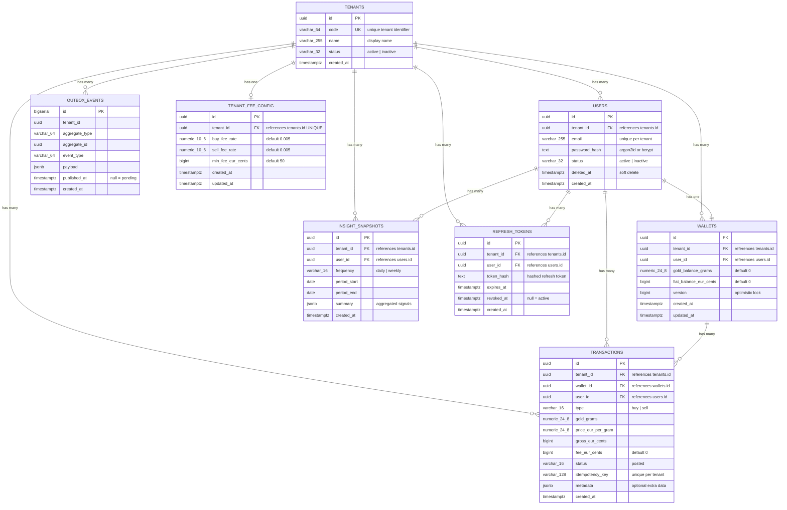
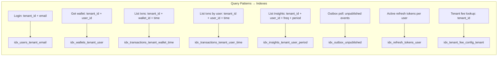

# Aurix — Database Schema

## Entity-Relationship Diagram



---

## Table Definitions

### tenants

Platform organizations. Seeded via admin scripts.

```sql
CREATE TABLE tenants (
    id          uuid        PRIMARY KEY,
    code        varchar(64) NOT NULL UNIQUE,
    name        varchar(255) NOT NULL,
    status      varchar(32) NOT NULL DEFAULT 'active',
    created_at  timestamptz NOT NULL DEFAULT now()
);
```

| Column | Type | Constraints | Notes |
|--------|------|-------------|-------|
| id | uuid | PK | Generated by application |
| code | varchar(64) | UNIQUE, NOT NULL | Used in registration/login |
| name | varchar(255) | NOT NULL | Display name |
| status | varchar(32) | NOT NULL, DEFAULT 'active' | `active`, `inactive` |
| created_at | timestamptz | NOT NULL, DEFAULT now() | |

---

### users

Registered accounts, scoped to a tenant.

```sql
CREATE TABLE users (
    id            uuid         PRIMARY KEY,
    tenant_id     uuid         NOT NULL REFERENCES tenants(id),
    email         varchar(255) NOT NULL,
    password_hash text         NOT NULL,
    status        varchar(32)  NOT NULL DEFAULT 'active',
    deleted_at    timestamptz,
    created_at    timestamptz  NOT NULL DEFAULT now(),
    UNIQUE (tenant_id, email)
);

CREATE INDEX idx_users_tenant_email ON users (tenant_id, email);
```

| Column | Type | Constraints | Notes |
|--------|------|-------------|-------|
| id | uuid | PK | |
| tenant_id | uuid | FK → tenants.id, NOT NULL | Tenant scope |
| email | varchar(255) | NOT NULL, UNIQUE per tenant | |
| password_hash | text | NOT NULL | argon2id or bcrypt hash |
| status | varchar(32) | NOT NULL, DEFAULT 'active' | |
| deleted_at | timestamptz | nullable | Soft delete timestamp |
| created_at | timestamptz | NOT NULL, DEFAULT now() | |

---

### wallets

One wallet per user per tenant. Balance columns for fast reads.

```sql
CREATE TABLE wallets (
    id                    uuid          PRIMARY KEY,
    tenant_id             uuid          NOT NULL REFERENCES tenants(id),
    user_id               uuid          NOT NULL REFERENCES users(id),
    gold_balance_grams    numeric(24,8) NOT NULL DEFAULT 0,
    fiat_balance_eur_cents bigint       NOT NULL DEFAULT 0,
    version               bigint        NOT NULL DEFAULT 0,
    created_at            timestamptz   NOT NULL DEFAULT now(),
    updated_at            timestamptz   NOT NULL DEFAULT now(),
    UNIQUE (tenant_id, user_id)
);

CREATE INDEX idx_wallets_tenant_user ON wallets (tenant_id, user_id);
```

| Column | Type | Constraints | Notes |
|--------|------|-------------|-------|
| id | uuid | PK | |
| tenant_id | uuid | FK → tenants.id | Tenant scope |
| user_id | uuid | FK → users.id | One wallet per user |
| gold_balance_grams | numeric(24,8) | NOT NULL, DEFAULT 0 | 8 decimal places |
| fiat_balance_eur_cents | bigint | NOT NULL, DEFAULT 0 | Integer cents, never float |
| version | bigint | NOT NULL, DEFAULT 0 | Optimistic concurrency (see note below) |
| created_at | timestamptz | NOT NULL | |
| updated_at | timestamptz | NOT NULL | Last modification |

**Why bigint for EUR?** Floating-point arithmetic is forbidden for financial calculations. Storing cents as integers eliminates rounding errors. `1000000` = €10,000.00.

**Why numeric(24,8) for gold?** Gold precision requires up to 8 decimal places. PostgreSQL `numeric` type provides exact arithmetic.

**Concurrency control strategy:** The primary locking mechanism is **pessimistic** — `SELECT ... FOR UPDATE` locks the wallet row during buy/sell transactions to prevent concurrent modification. The `version` column provides a **secondary optimistic check** for non-transactional read paths (e.g., reconciliation jobs or future API consumers that need conflict detection without holding a row lock). On each wallet update, `version` is incremented: `SET version = version + 1`. Both mechanisms coexist without conflict.

---

### transactions

Immutable ledger of all buy/sell operations. Append-only.

```sql
CREATE TABLE transactions (
    id               uuid          PRIMARY KEY,
    tenant_id        uuid          NOT NULL REFERENCES tenants(id),
    wallet_id        uuid          NOT NULL REFERENCES wallets(id),
    user_id          uuid          NOT NULL REFERENCES users(id),
    type             varchar(16)   NOT NULL CHECK (type IN ('buy', 'sell')),
    gold_grams       numeric(24,8) NOT NULL,
    price_eur_per_gram numeric(24,8) NOT NULL,
    gross_eur_cents  bigint        NOT NULL,
    fee_eur_cents    bigint        NOT NULL DEFAULT 0,
    status           varchar(16)   NOT NULL DEFAULT 'posted',
    idempotency_key  varchar(128)  NOT NULL,
    metadata         jsonb,
    created_at       timestamptz   NOT NULL DEFAULT now(),
    UNIQUE (tenant_id, idempotency_key)
);

CREATE INDEX idx_transactions_tenant_wallet_time
    ON transactions (tenant_id, wallet_id, created_at DESC);

CREATE INDEX idx_transactions_tenant_user_time
    ON transactions (tenant_id, user_id, created_at DESC);
```

| Column | Type | Constraints | Notes |
|--------|------|-------------|-------|
| id | uuid | PK | |
| tenant_id | uuid | FK → tenants.id | Tenant scope |
| wallet_id | uuid | FK → wallets.id | |
| user_id | uuid | FK → users.id | Denormalized for query speed |
| type | varchar(16) | CHECK (buy, sell) | |
| gold_grams | numeric(24,8) | NOT NULL | Amount traded |
| price_eur_per_gram | numeric(24,8) | NOT NULL | Price at time of trade |
| gross_eur_cents | bigint | NOT NULL | Before fee |
| fee_eur_cents | bigint | NOT NULL, DEFAULT 0 | Fee amount |
| status | varchar(16) | NOT NULL, DEFAULT 'posted' | Always 'posted' for now |
| idempotency_key | varchar(128) | NOT NULL, UNIQUE per tenant | Prevents duplicate trades |
| metadata | jsonb | nullable | Optional extra data |
| created_at | timestamptz | NOT NULL | Immutable |

---

### insight_snapshots

Pre-computed trading insights from ETL aggregation.

```sql
CREATE TABLE insight_snapshots (
    id           uuid        PRIMARY KEY,
    tenant_id    uuid        NOT NULL REFERENCES tenants(id),
    user_id      uuid        NOT NULL REFERENCES users(id),
    frequency    varchar(16) NOT NULL CHECK (frequency IN ('daily', 'weekly')),
    period_start date        NOT NULL,
    period_end   date        NOT NULL,
    summary      jsonb       NOT NULL,
    created_at   timestamptz NOT NULL DEFAULT now(),
    UNIQUE (tenant_id, user_id, frequency, period_start, period_end)
);

CREATE INDEX idx_insights_tenant_user_period
    ON insight_snapshots (tenant_id, user_id, frequency, period_end DESC);
```

### summary JSONB Structure

```json
{
    "buy_count": 4,
    "sell_count": 1,
    "total_gold_bought_grams": "5.00000000",
    "total_gold_sold_grams": "0.50000000",
    "average_buy_price_eur_per_gram": "68.12",
    "average_sell_price_eur_per_gram": "65.00",
    "total_fees_eur_cents": 200,
    "buy_frequency_per_week": 4,
    "sell_after_buy_ratio": 0.25,
    "reference_price_eur_per_gram": "64.90"
}
```

---

### outbox_events

Transactional outbox for reliable event publishing.

```sql
CREATE TABLE outbox_events (
    id             bigserial   PRIMARY KEY,
    tenant_id      uuid        NOT NULL,
    aggregate_type varchar(64) NOT NULL,
    aggregate_id   uuid        NOT NULL,
    event_type     varchar(64) NOT NULL,
    payload        jsonb       NOT NULL,
    published_at   timestamptz,
    created_at     timestamptz NOT NULL DEFAULT now()
);

CREATE INDEX idx_outbox_unpublished
    ON outbox_events (published_at) WHERE published_at IS NULL;
```

| Column | Type | Notes |
|--------|------|-------|
| id | bigserial | Auto-incrementing for ordering |
| tenant_id | uuid | Event context |
| aggregate_type | varchar(64) | e.g., `wallet`, `transaction` |
| aggregate_id | uuid | ID of the aggregate root |
| event_type | varchar(64) | e.g., `wallet.buy.posted` |
| payload | jsonb | Full event payload |
| published_at | timestamptz | NULL = pending, non-null = published |
| created_at | timestamptz | |

---

### refresh_tokens

Hashed refresh tokens for session management.

```sql
CREATE TABLE refresh_tokens (
    id         uuid        PRIMARY KEY,
    tenant_id  uuid        NOT NULL REFERENCES tenants(id),
    user_id    uuid        NOT NULL REFERENCES users(id),
    token_hash text        NOT NULL,
    expires_at timestamptz NOT NULL,
    revoked_at timestamptz,
    created_at timestamptz NOT NULL DEFAULT now()
);

CREATE INDEX idx_refresh_tokens_user
    ON refresh_tokens (tenant_id, user_id) WHERE revoked_at IS NULL;
```

---

### tenant_fee_config

Per-tenant fee schedule for buy and sell operations.

```sql
CREATE TABLE tenant_fee_config (
    id             uuid          PRIMARY KEY,
    tenant_id      uuid          NOT NULL REFERENCES tenants(id) UNIQUE,
    buy_fee_rate   numeric(10,6) NOT NULL DEFAULT 0.005000,
    sell_fee_rate  numeric(10,6) NOT NULL DEFAULT 0.005000,
    min_fee_eur_cents bigint     NOT NULL DEFAULT 50,
    created_at     timestamptz   NOT NULL DEFAULT now(),
    updated_at     timestamptz   NOT NULL DEFAULT now()
);

CREATE UNIQUE INDEX idx_tenant_fee_config_tenant ON tenant_fee_config (tenant_id);
```

| Column | Type | Constraints | Notes |
|--------|------|-------------|-------|
| id | uuid | PK | |
| tenant_id | uuid | FK → tenants.id, UNIQUE | One config per tenant |
| buy_fee_rate | numeric(10,6) | NOT NULL, DEFAULT 0.005000 | 0.5% default |
| sell_fee_rate | numeric(10,6) | NOT NULL, DEFAULT 0.005000 | 0.5% default |
| min_fee_eur_cents | bigint | NOT NULL, DEFAULT 50 | Minimum 0.50 EUR |
| created_at | timestamptz | NOT NULL | |
| updated_at | timestamptz | NOT NULL | Last modification |

**Behavior:** If no `tenant_fee_config` row exists for a tenant, the service layer falls back to application-level defaults (0.5% rate, 50 cents minimum). Fee changes take effect on the next transaction.

---

### etl_metadata

Watermark tracking for ETL jobs.

```sql
CREATE TABLE etl_metadata (
    id            varchar(64) PRIMARY KEY,
    last_processed_at timestamptz NOT NULL DEFAULT '1970-01-01T00:00:00Z',
    updated_at    timestamptz NOT NULL DEFAULT now()
);

INSERT INTO etl_metadata (id, last_processed_at)
VALUES ('transaction_etl', '1970-01-01T00:00:00Z');
```

---

## Seed Data

```sql
-- Demo tenant
INSERT INTO tenants (id, code, name, status)
VALUES (
    'a0000000-0000-0000-0000-000000000001',
    'aurix-demo',
    'Aurix Demo Tenant',
    'active'
);

-- Second tenant for isolation testing
INSERT INTO tenants (id, code, name, status)
VALUES (
    'b0000000-0000-0000-0000-000000000002',
    'partner-co',
    'Partner Company',
    'active'
);

-- Default fee config for demo tenant (0.5% rate, 0.50 EUR minimum)
INSERT INTO tenant_fee_config (id, tenant_id, buy_fee_rate, sell_fee_rate, min_fee_eur_cents)
VALUES (
    'c0000000-0000-0000-0000-000000000001',
    'a0000000-0000-0000-0000-000000000001',
    0.005000,
    0.005000,
    50
);

-- ETL watermark
INSERT INTO etl_metadata (id, last_processed_at)
VALUES ('transaction_etl', '1970-01-01T00:00:00Z');
```

---

## Index Strategy



All composite indexes start with `tenant_id` to ensure tenant-scoped queries use the index efficiently.

---

## Migration Strategy

### File Naming Convention

```
priv/sql/
├── 001_create_tenants.sql
├── 002_create_users.sql
├── 003_create_wallets.sql
├── 004_create_transactions.sql
├── 005_create_insight_snapshots.sql
├── 006_create_outbox_events.sql
├── 007_create_refresh_tokens.sql
├── 008_create_tenant_fee_config.sql
├── 009_create_etl_metadata.sql
├── 010_create_indexes.sql
└── 011_seed_demo_data.sql
```

### Migration Execution

Migrations run in order via a startup script or Docker entrypoint:

```bash
for f in priv/sql/*.sql; do
    psql -U aurix -d aurix -f "$f"
done
```

### Safety Rules

- All migrations are idempotent (use `IF NOT EXISTS` where possible)
- Never drop columns in production without a deprecation window
- Schema changes are applied before code deployment
- Rollback scripts maintained for each migration
