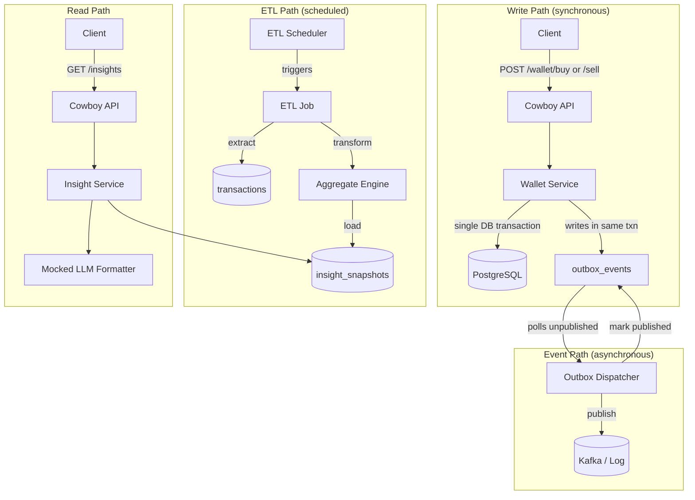
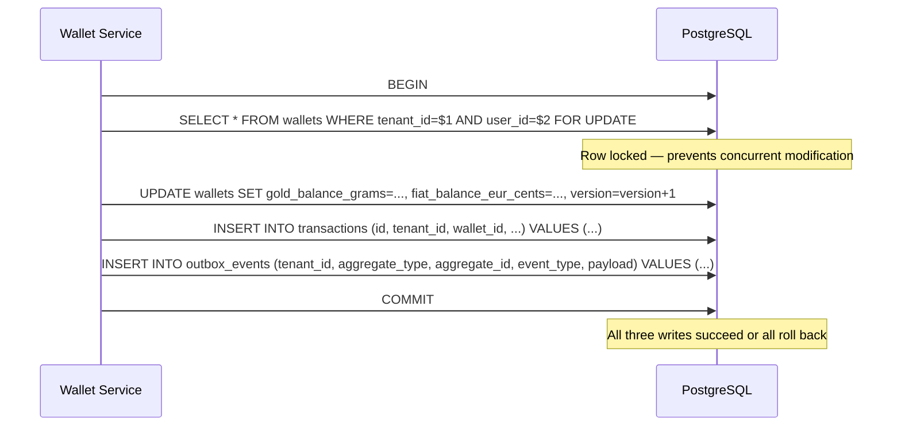
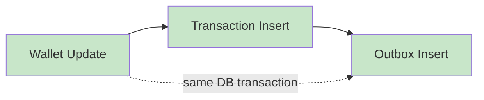
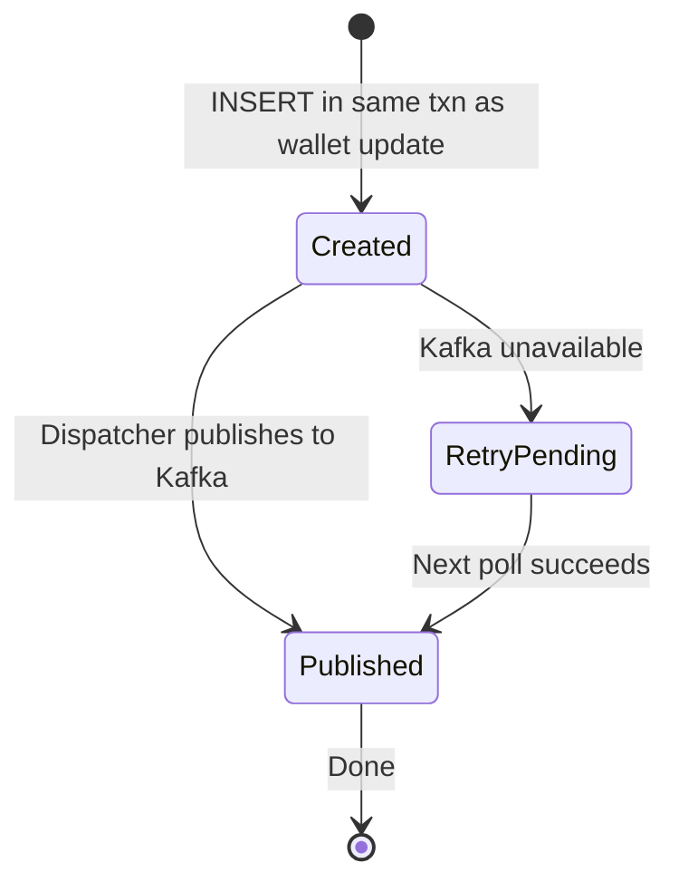
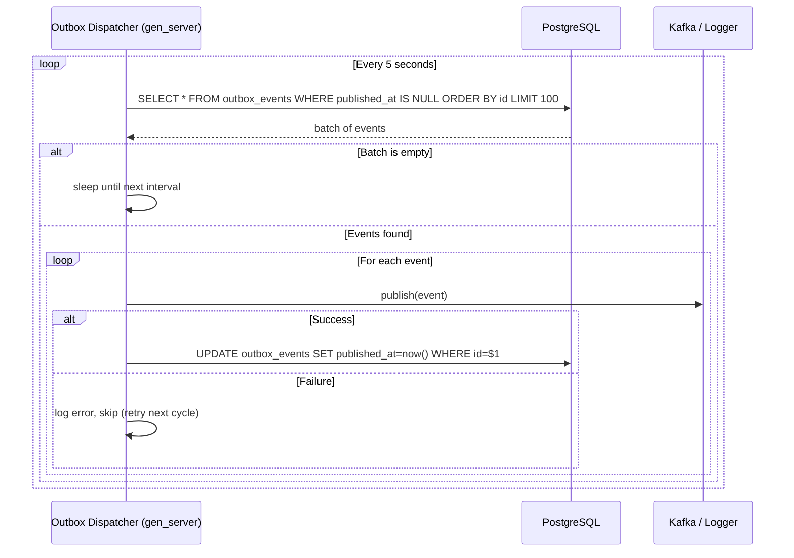
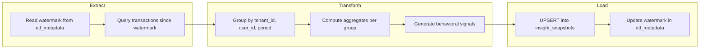
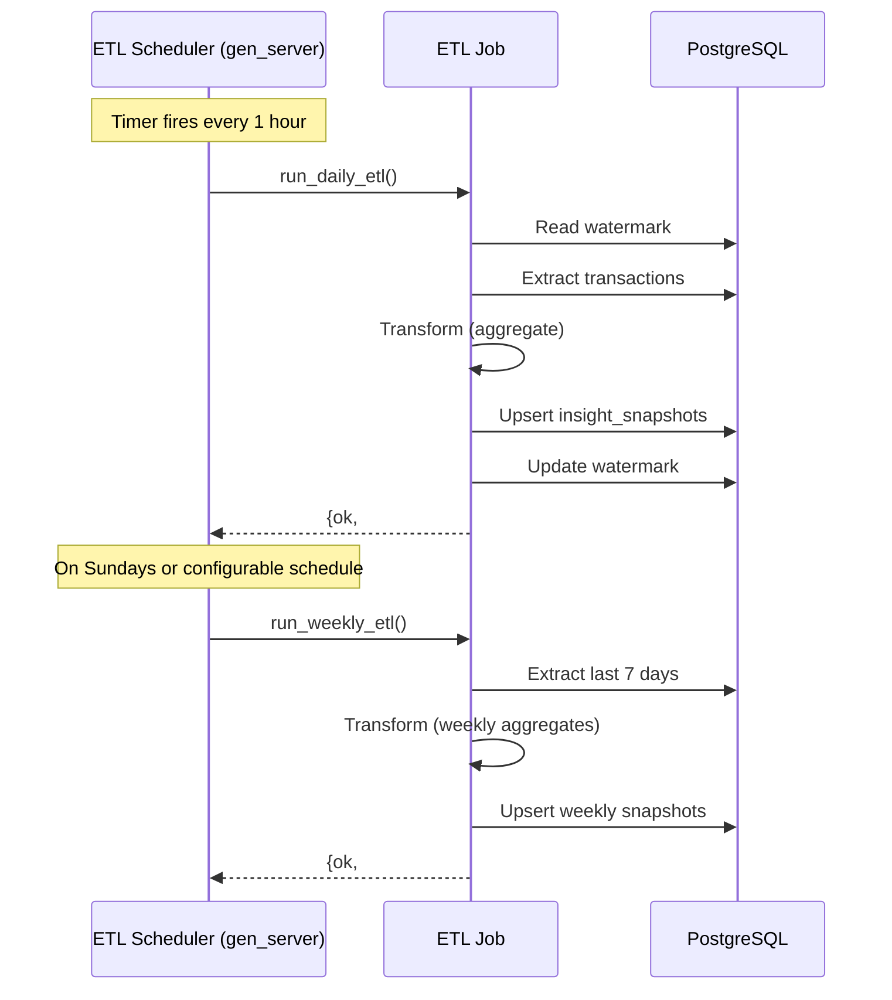
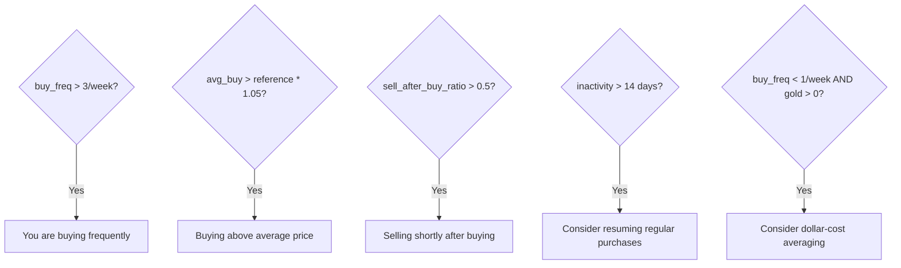
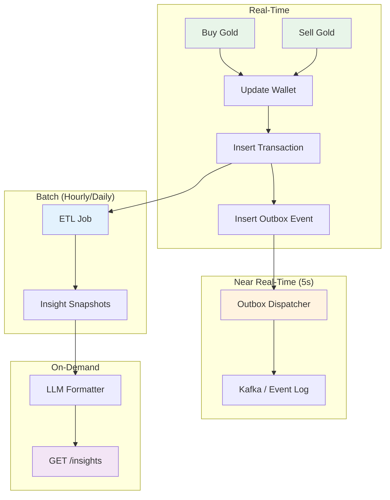
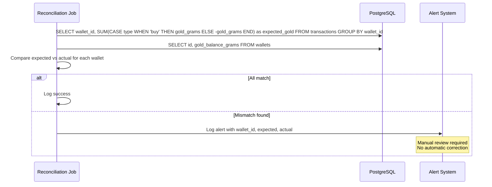

# Aurix — Data Flow & ETL Pipeline

## 1. Overview



## 2. Transaction Write Flow (Detail)

Every buy or sell operation writes **three records** in a single PostgreSQL transaction:



### Atomicity Guarantee



If any insert fails, the entire transaction rolls back. No partial state.

## 3. Outbox Event Dispatch

### Pattern: Transactional Outbox

The outbox pattern ensures events are never lost, even if the message broker is down.



### Dispatcher Process



### Event Payload Example

```json
{
    "event_type": "wallet.buy.posted",
    "tenant_id": "a0000000-0000-0000-0000-000000000001",
    "aggregate_type": "wallet",
    "aggregate_id": "770e8400-e29b-41d4-a716-446655440000",
    "payload": {
        "transaction_id": "880e8400-e29b-41d4-a716-446655440000",
        "user_id": "550e8400-e29b-41d4-a716-446655440000",
        "type": "buy",
        "gold_grams": "1.25000000",
        "price_eur_per_gram": "65.00000000",
        "gross_eur_cents": 8125,
        "fee_eur_cents": 50,
        "timestamp": "2026-04-02T10:00:00Z"
    },
    "created_at": "2026-04-02T10:00:00Z"
}
```

## 4. ETL Pipeline

### Flow



### Extract Phase

```sql
-- Read watermark
SELECT last_processed_at FROM etl_metadata WHERE id = 'transaction_etl';

-- Extract transactions since watermark
SELECT
    tenant_id,
    user_id,
    wallet_id,
    type,
    gold_grams,
    price_eur_per_gram,
    gross_eur_cents,
    fee_eur_cents,
    created_at
FROM transactions
WHERE created_at > $watermark
  AND status = 'posted'
ORDER BY created_at ASC;
```

### Transform Phase

Group transactions by (tenant_id, user_id) and compute:

| Signal | Computation |
|--------|------------|
| `buy_count` | COUNT WHERE type = 'buy' |
| `sell_count` | COUNT WHERE type = 'sell' |
| `total_gold_bought_grams` | SUM(gold_grams) WHERE type = 'buy' |
| `total_gold_sold_grams` | SUM(gold_grams) WHERE type = 'sell' |
| `average_buy_price_eur_per_gram` | AVG(price_eur_per_gram) WHERE type = 'buy' |
| `average_sell_price_eur_per_gram` | AVG(price_eur_per_gram) WHERE type = 'sell' |
| `total_fees_eur_cents` | SUM(fee_eur_cents) |
| `buy_frequency_per_week` | buy_count / weeks_in_period |
| `sell_after_buy_ratio` | sell_count / buy_count |
| `reference_price_eur_per_gram` | Current price from price provider |

### Load Phase

```sql
-- Upsert insight snapshot
INSERT INTO insight_snapshots (id, tenant_id, user_id, frequency, period_start, period_end, summary)
VALUES ($1, $2, $3, $4, $5, $6, $7)
ON CONFLICT (tenant_id, user_id, frequency, period_start, period_end)
DO UPDATE SET summary = $7, created_at = now();

-- Update watermark
UPDATE etl_metadata
SET last_processed_at = $new_watermark, updated_at = now()
WHERE id = 'transaction_etl';
```

### Scheduling



### Idempotency

- The `UPSERT` (INSERT ... ON CONFLICT DO UPDATE) ensures re-running the ETL for the same period is safe
- Watermarks prevent reprocessing old data in normal runs
- A manual trigger re-runs from the current watermark

## 5. AI Insight Generation

### Two-Step Architecture

```mermaid
flowchart LR
    subgraph "Step 1: Signal Extraction"
        Snapshot[insight_snapshots.summary] --> Signals[Structured Signals]
    end

    subgraph "Step 2: LLM Formatting"
        Signals --> Adapter[aurix_llm_adapter<br/>Mocked]
        Adapter --> NL[Natural Language Insights]
    end

    subgraph "Response"
        Signals --> Response[API Response]
        NL --> Response
    end
```

### Signal → Insight Mapping Rules



### Mocked LLM Adapter

The adapter receives a structured signal map and returns formatted text:

```erlang
%% Input signals:
#{
    buy_frequency_per_week => 4,
    average_buy_price_eur_per_gram => <<"68.12">>,
    reference_price_eur_per_gram => <<"64.90">>,
    sell_after_buy_ratio => 0.25
}

%% Output insights (list of strings):
[
    <<"You are buying frequently at prices above your weekly reference average.">>,
    <<"Consider averaging your purchases across multiple days instead of clustering them.">>
]
```

In production, this adapter could call an external LLM API. The interface remains the same.

## 6. Data Flow Summary



## 7. Reconciliation Job

A periodic job verifies that wallet balances match the transaction ledger:


