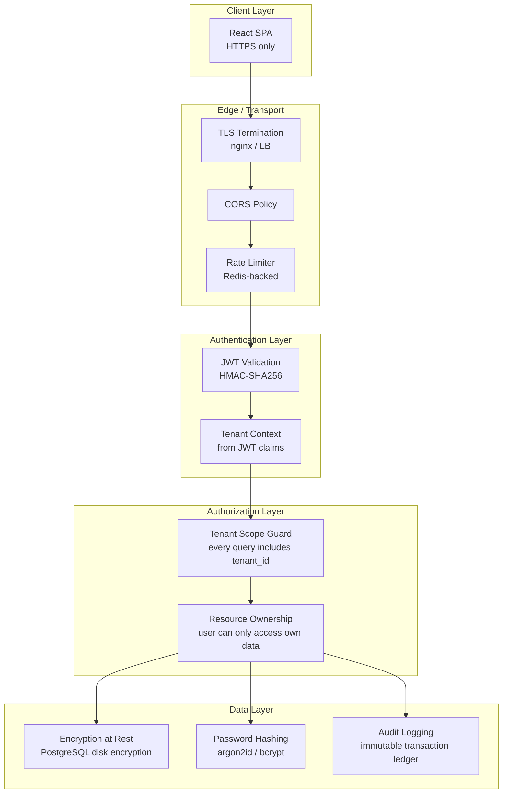
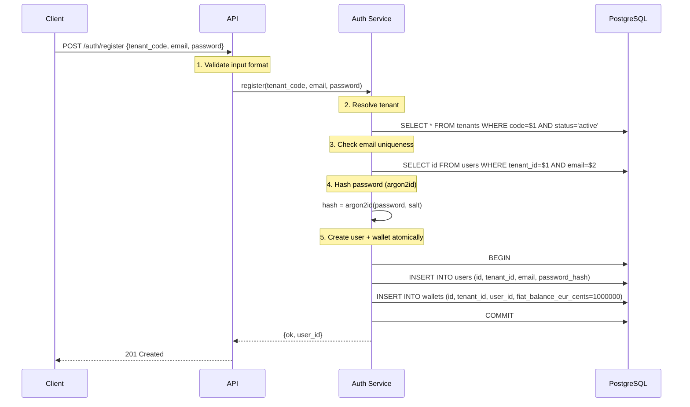
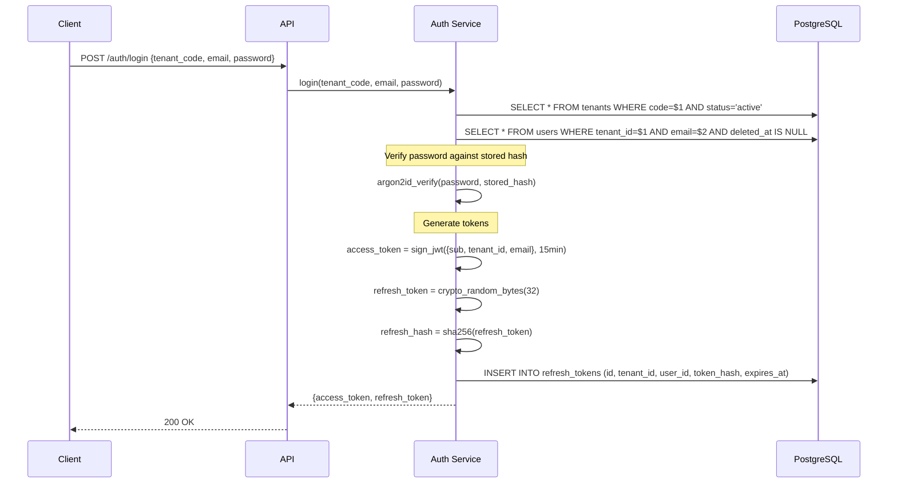
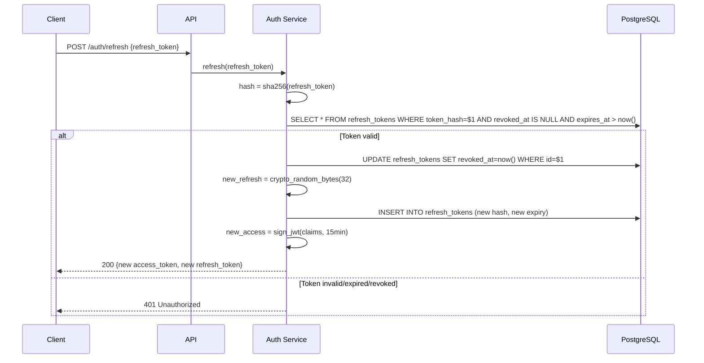
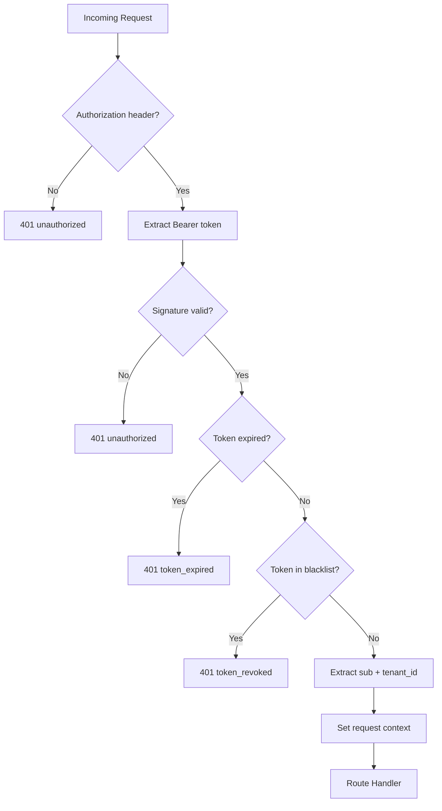
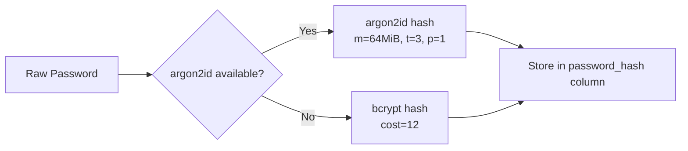
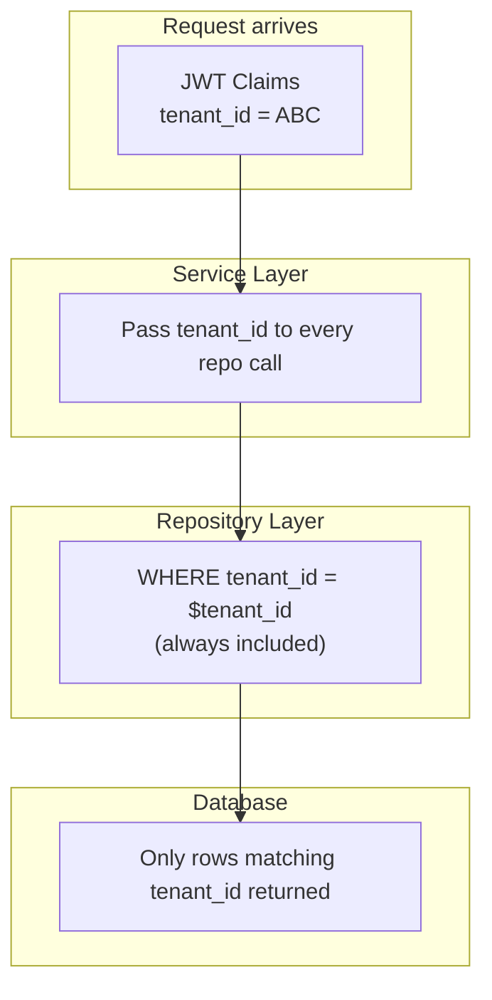
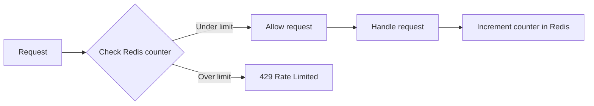
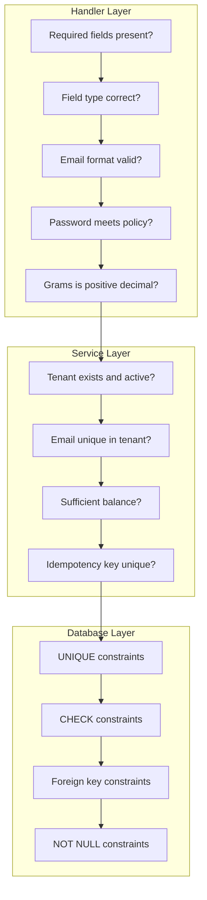

# Aurix — Security & Authentication

## 1. Security Architecture Overview



## 2. Authentication Flow

### Registration



### Login



### Token Refresh



## 3. JWT Design

### Token Structure

```
Header.Payload.Signature
```

**Header:**
```json
{
    "alg": "HS256",
    "typ": "JWT"
}
```

**Payload (Claims):**
```json
{
    "sub": "550e8400-e29b-41d4-a716-446655440000",
    "tenant_id": "a0000000-0000-0000-0000-000000000001",
    "email": "user@example.com",
    "iat": 1770000000,
    "exp": 1770000900
}
```

### JWT Validation Middleware



### Early Token Revocation (JWT Blacklist)

Access tokens are stateless by design (15-minute expiry), but certain events require immediate invalidation before expiry:

- **Password change** — all active tokens for the user must be revoked
- **Account compromise** — admin-initiated emergency revocation
- **Account deactivation** — user or admin disables the account

**Implementation:**
- On revocation, store `{jti or sub+iat}` in Redis with a TTL equal to the token's remaining lifetime
- The JWT validation middleware checks Redis for blacklisted tokens after signature and expiry validation
- Redis key format: `jwt:blacklist:{user_id}:{iat}` with TTL = `exp - now()`
- Since access tokens are short-lived (15 min), the blacklist stays small and self-cleans via TTL

**Performance:** A single Redis `EXISTS` check per request adds < 1ms latency. This is acceptable for critical security operations.

### Security Rules for JWT

| Rule | Implementation |
|------|---------------|
| Signature algorithm | HMAC-SHA256 only (reject `none` and RS* if not configured) |
| Secret key | Loaded from environment variable, minimum 256 bits |
| Expiry | 15 minutes for access tokens |
| Claims validation | Always check `exp`, `sub`, `tenant_id` |
| Tenant context | Derived exclusively from JWT claims, never from request params |

## 4. Password Security

### Hashing Strategy



### argon2id Parameters

| Parameter | Value | Rationale |
|-----------|-------|-----------|
| Memory (m) | 64 MiB | OWASP recommended minimum |
| Iterations (t) | 3 | Balance between security and latency |
| Parallelism (p) | 1 | Single thread per hash |

### Password Requirements

| Rule | Value |
|------|-------|
| Minimum length | 10 characters |
| Maximum length | 128 characters |
| Uppercase | At least 1 |
| Lowercase | At least 1 |
| Digit | At least 1 |

### Hash Migration

The `password_hash` column stores the algorithm identifier as part of the hash string (e.g., `$argon2id$...` or `$2b$...`). On login, if the hash uses an older algorithm, the system re-hashes with the current preferred algorithm and updates the record.

## 5. Multi-Tenant Security

### Tenant Isolation Model



### Isolation Rules

1. **JWT is the single source of truth** for tenant context on authenticated endpoints
2. **Every SQL query** on tenant-scoped tables includes `WHERE tenant_id = $tenant_id`
3. **No cross-tenant joins** in application code
4. **Composite indexes** start with `tenant_id` for efficient filtered queries
5. **Public endpoints** (register/login) resolve tenant from `tenant_code` in the request body

### Future: Row-Level Security

```sql
-- Defense-in-depth (not required for initial release)
ALTER TABLE wallets ENABLE ROW LEVEL SECURITY;

CREATE POLICY tenant_isolation ON wallets
    USING (tenant_id = current_setting('app.current_tenant_id')::uuid);
```

## 6. Rate Limiting

### Architecture



### Algorithm: Sliding Window with Redis

```
Key:    rate:{scope}:{identifier}:{window}
Value:  counter
TTL:    window duration
```

### Rate Limit Rules

| Endpoint | Scope | Key Pattern | Limit | Window |
|----------|-------|-------------|-------|--------|
| POST /auth/login | IP + Tenant | `rate:login:{ip}:{tenant}:{min}` | 10 | 1 min |
| POST /auth/register | IP + Tenant | `rate:register:{ip}:{tenant}:{min}` | 5 | 1 min |
| POST /auth/change-password | User | `rate:change_pw:{user_id}:{min}` | 5 | 1 min |
| POST /wallet/buy | User | `rate:buy:{user_id}:{min}` | 30 | 1 min |
| POST /wallet/sell | User | `rate:sell:{user_id}:{min}` | 30 | 1 min |
| GET /wallet | User | `rate:wallet:{user_id}:{min}` | 60 | 1 min |
| GET /transactions | User | `rate:transactions:{user_id}:{min}` | 60 | 1 min |
| GET /insights | User | `rate:insights:{user_id}:{min}` | 60 | 1 min |

### Response Headers

```
X-RateLimit-Limit: 30
X-RateLimit-Remaining: 25
X-RateLimit-Reset: 1770000060
Retry-After: 45
```

## 7. Input Validation

### Validation Strategy by Layer



### Injection Prevention

| Attack Vector | Mitigation |
|---------------|-----------|
| SQL Injection | Parameterized queries only (never string interpolation) |
| XSS | JSON-only responses, no HTML rendering on backend |
| CSRF | JWT in Authorization header (not cookies) |
| Mass Assignment | Explicit field extraction from request body |
| Path Traversal | No file system operations from user input |

## 8. CORS Policy

```erlang
%% Allowed origins (configurable)
Access-Control-Allow-Origin: http://localhost:3000
Access-Control-Allow-Methods: GET, POST, OPTIONS
Access-Control-Allow-Headers: Content-Type, Authorization, Idempotency-Key, X-Request-Id
Access-Control-Max-Age: 86400
```

## 9. Logging & Audit

### What is logged

| Event | Fields | Sensitivity |
|-------|--------|-------------|
| Registration | request_id, tenant_id, email (masked), timestamp | Medium |
| Login attempt | request_id, tenant_id, email (masked), success/fail, IP | Medium |
| Token refresh | request_id, tenant_id, user_id | Low |
| Buy/Sell | request_id, tenant_id, user_id, tx_id, amount | Medium |
| Rate limit hit | IP, tenant_id, endpoint, timestamp | Low |
| ETL run | job_id, processed_count, duration | Low |

### What is NEVER logged

- Raw passwords
- Full JWT tokens
- Full email addresses (use masked form: `u***@example.com`)
- Refresh token values
- Database connection strings with credentials

### Structured Log Format

```json
{
    "timestamp": "2026-04-02T10:00:00.000Z",
    "level": "info",
    "request_id": "req-abc-123",
    "tenant_id": "a0000000-...",
    "user_id": "550e8400-...",
    "action": "wallet.buy",
    "transaction_id": "880e8400-...",
    "gold_grams": "1.25000000",
    "duration_ms": 42
}
```

## 10. Secrets Management

| Secret | Storage | Rotation |
|--------|---------|----------|
| JWT signing key | Environment variable | Rotate quarterly, support key ID for overlap |
| DB password | Environment variable / Docker secret | Rotate on schedule |
| Redis password | Environment variable / Docker secret | Rotate on schedule |
| argon2id salt | Generated per hash (embedded in hash string) | N/A |

### Docker Secrets (production)

```yaml
secrets:
  jwt_secret:
    external: true
  db_password:
    external: true
```

## 11. OWASP Top 10 Checklist

| # | Risk | Mitigation |
|---|------|-----------|
| A01 | Broken Access Control | JWT + tenant scoping + resource ownership checks |
| A02 | Cryptographic Failures | argon2id for passwords, TLS in transit, encrypted at rest |
| A03 | Injection | Parameterized SQL queries only |
| A04 | Insecure Design | Threat model in design phase, separation of concerns |
| A05 | Security Misconfiguration | Minimal Docker images, no debug in production |
| A06 | Vulnerable Components | Dependency scanning in CI |
| A07 | Auth Failures | Rate limiting on login, strong password policy, token rotation |
| A08 | Data Integrity Failures | Immutable ledger, idempotency keys, outbox pattern |
| A09 | Logging Failures | Structured logging, no sensitive data in logs |
| A10 | SSRF | No user-controlled outbound HTTP requests |

## 12. GDPR-Relevant Security Controls

| Control | Implementation |
|---------|---------------|
| Data minimization | Store only required fields |
| Purpose limitation | Clear separation of operational and analytics data |
| Right to access | GET /privacy/export endpoint |
| Right to erasure | POST /privacy/erasure-request with controlled workflow |
| Encryption in transit | TLS 1.2+ |
| Encryption at rest | PostgreSQL disk-level encryption |
| Breach notification | Incident response procedure documented |
| Pseudonymization | ETL datasets use anonymized aggregates |
