# Aurix — System Design

## 1. High-Level Architecture

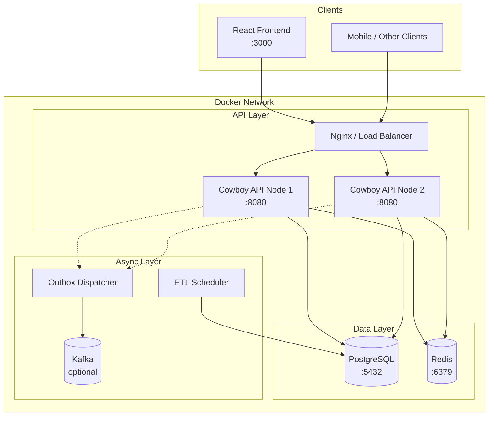

## 2. Component Architecture

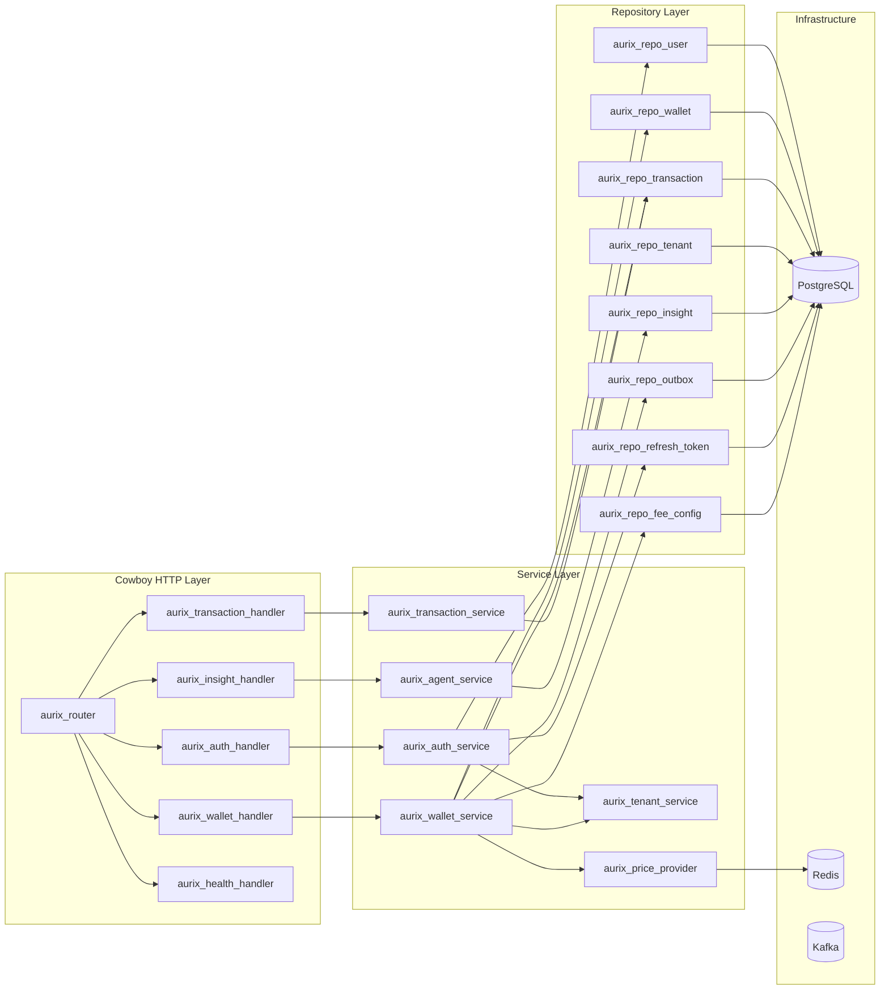

## 3. OTP Supervision Tree

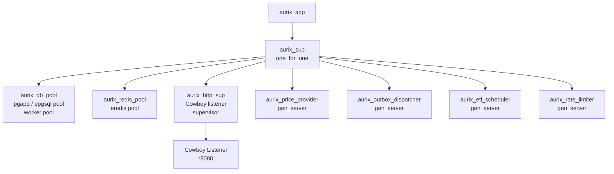

### Supervision Strategy

| Supervisor | Strategy | Rationale |
|-----------|----------|-----------|
| `aurix_sup` | `one_for_one` | Independent children; crash in ETL must not restart HTTP |
| `aurix_http_sup` | `one_for_one` | Cowboy manages its own connection processes |

### Restart Intensity

- Max restarts: 5 in 60 seconds
- If exceeded, the supervisor itself crashes upward

## 4. Request Lifecycle

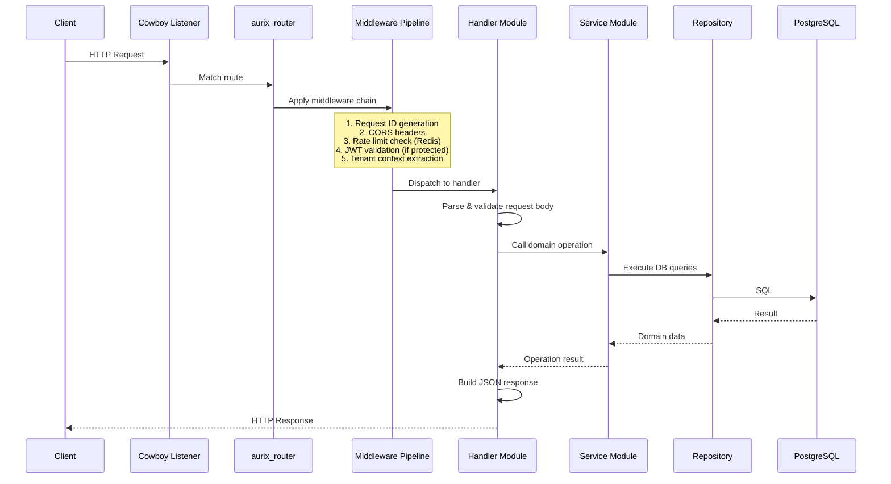

## 5. Multi-Tenant Architecture

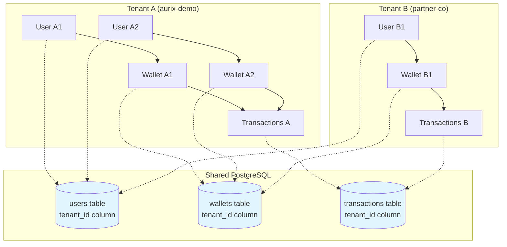

### Isolation Rules

1. Every tenant-scoped table has a `tenant_id` column
2. Every query includes `WHERE tenant_id = $tenant_id`
3. JWT claims carry `tenant_id` — no request parameter override
4. Composite indexes start with `tenant_id`
5. No cross-tenant joins in application code

### Future Evolution Path

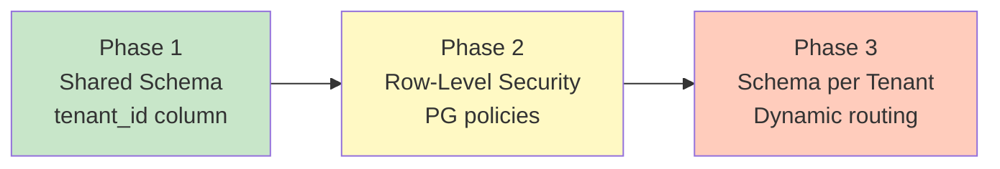

## 6. Concurrency Model

### Erlang/OTP Process Model

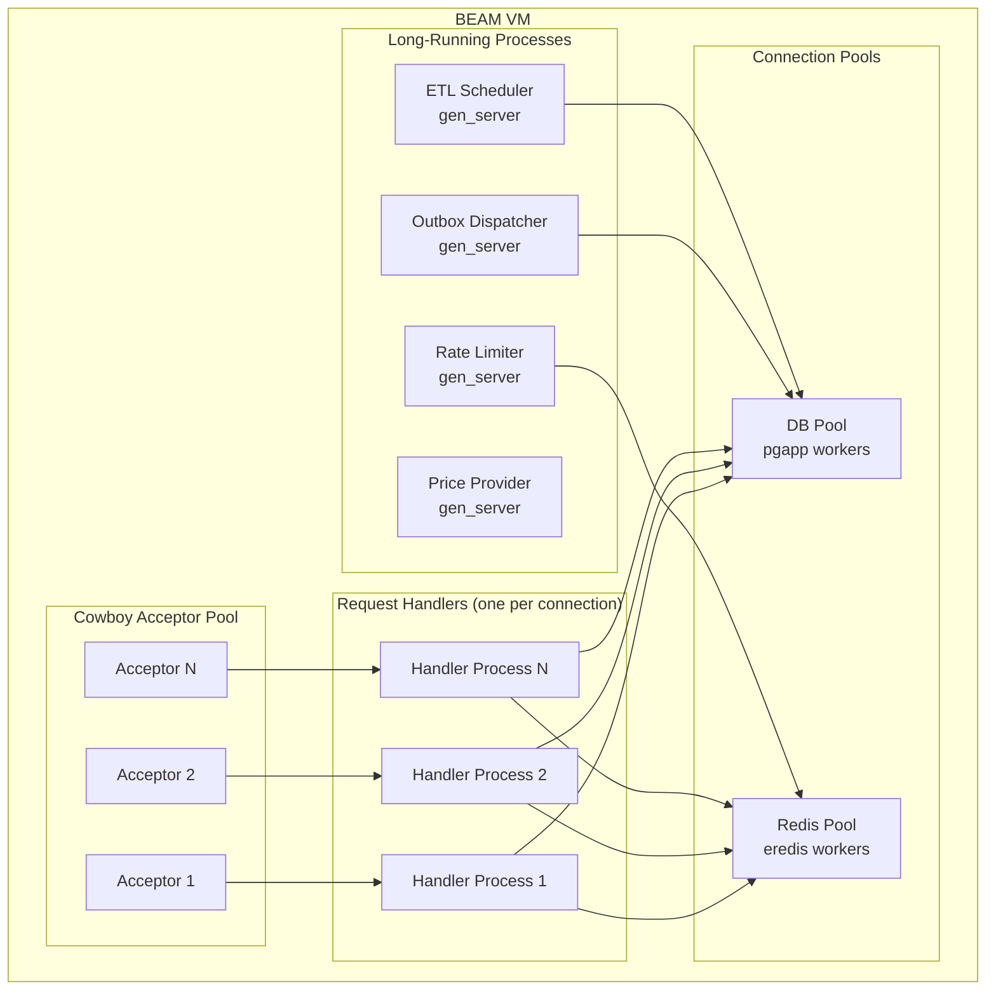

### Database Concurrency

- Wallet writes use `SELECT ... FOR UPDATE` row-level locks
- Each wallet operation is a single PostgreSQL transaction
- No long-held locks — transactions are designed to be fast
- Idempotency keys prevent duplicate execution on retry

## 7. Caching Strategy

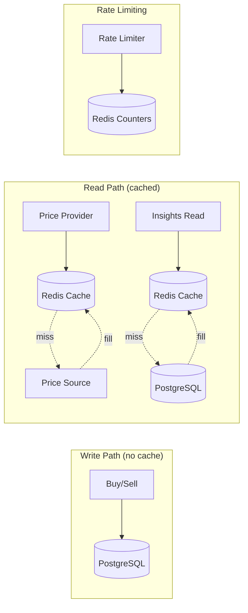

### Cache Rules

| Data | Cached? | TTL | Invalidation |
|------|---------|-----|-------------|
| Gold price | Yes | 60s | TTL expiry |
| Wallet balance | **No** | — | Always read from DB on writes |
| Insights | Yes | 5 min | TTL or ETL run |
| Rate limit counters | Yes | Window-based | Sliding window expiry |
| JWT | **No** | — | Stateless verification |

## 8. Error Handling Strategy

### Layer-Specific Error Handling

```mermaid
flowchart TD
    Handler[Handler Layer] -->|pattern match| ServiceErr{Service Error?}
    ServiceErr -->|insufficient_balance| R422[422 + error JSON]
    ServiceErr -->|not_found| R404[404 + error JSON]
    ServiceErr -->|duplicate_key| R409[409 + error JSON]
    ServiceErr -->|validation_error| R400[400 + error JSON]
    ServiceErr -->|unexpected| R500[500 + generic message]

    Service[Service Layer] -->|{error, Reason}| Handler
    Service -->|exception| Crash[Crash → Supervisor restart]

    Repo[Repository Layer] -->|DB error| Service
    Repo -->|constraint violation| Service
```

### Standard Error Response Format

```json
{
    "error": {
        "code": "insufficient_balance",
        "message": "Not enough EUR balance to complete this purchase",
        "details": {
            "required_eur_cents": 8125,
            "available_eur_cents": 5000
        }
    }
}
```

## 9. Scaling Architecture (Millions of Users)

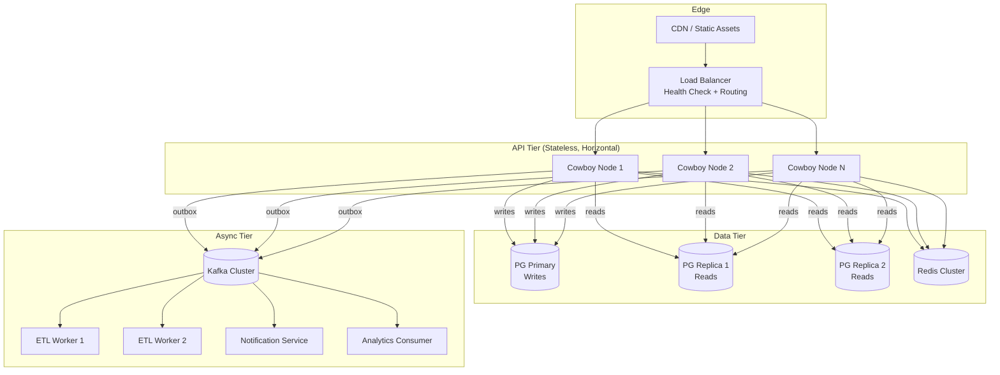

### Scaling Strategies by Tier

| Tier | Strategy | Trigger |
|------|----------|---------|
| API | Add more stateless nodes | CPU/connection saturation |
| DB Writes | Vertical scale primary, then shard by tenant | Write IOPS limit |
| DB Reads | Add replicas | Read query volume |
| Cache | Redis Cluster | Memory or connection limits |
| Async | Add Kafka partitions + consumers | Event lag |
| ETL | Parallel workers by tenant | Processing time exceeds window |

## 10. Docker Infrastructure

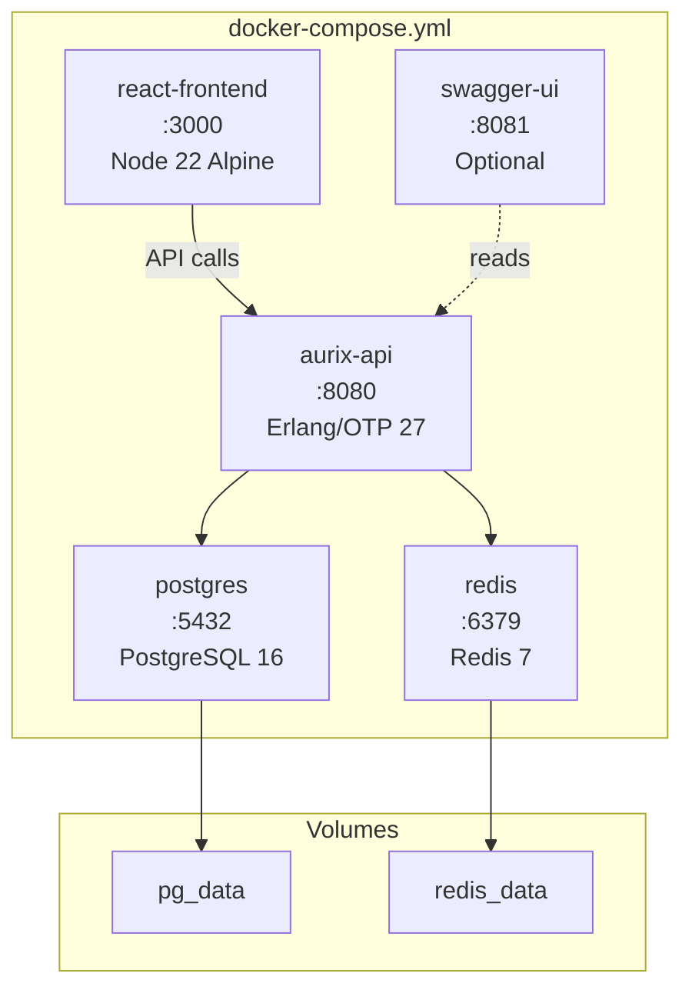

### Container Overview

| Service | Image | Port | Purpose |
|---------|-------|------|---------|
| `aurix-api` | Custom Erlang/OTP release | 8080 | Backend API |
| `react-frontend` | Custom Node.js | 3000 | React SPA |
| `postgres` | postgres:16-alpine | 5432 | Primary database |
| `redis` | redis:7-alpine | 6379 | Cache + rate limiting |
| `swagger-ui` | swaggerapi/swagger-ui | 8081 | API documentation |

## 11. Network & Security Boundaries

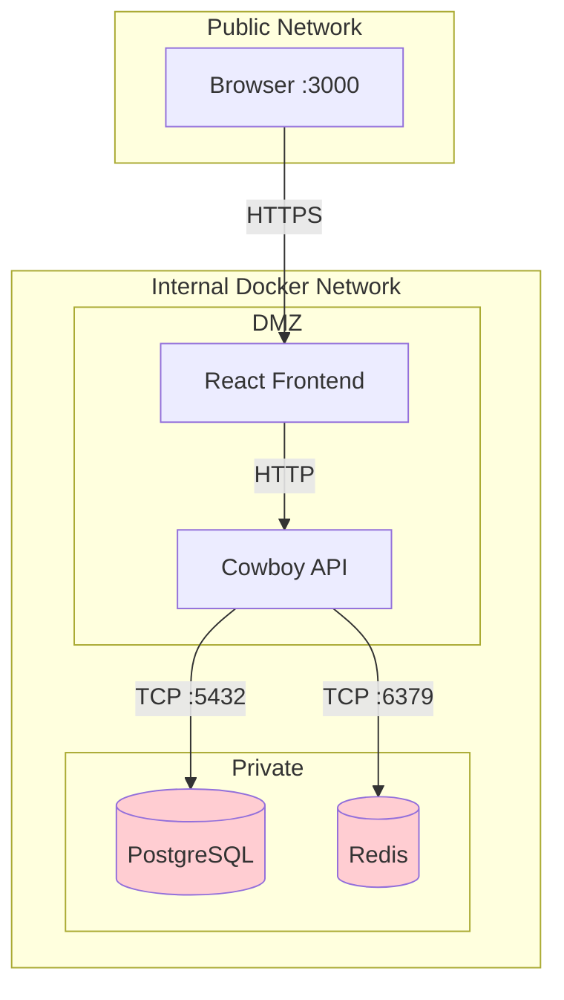

- PostgreSQL and Redis are **not** exposed to the host by default
- Only the frontend (3000) and API (8080) are accessible externally
- In production: TLS termination at load balancer, internal traffic is plain TCP within the private network
