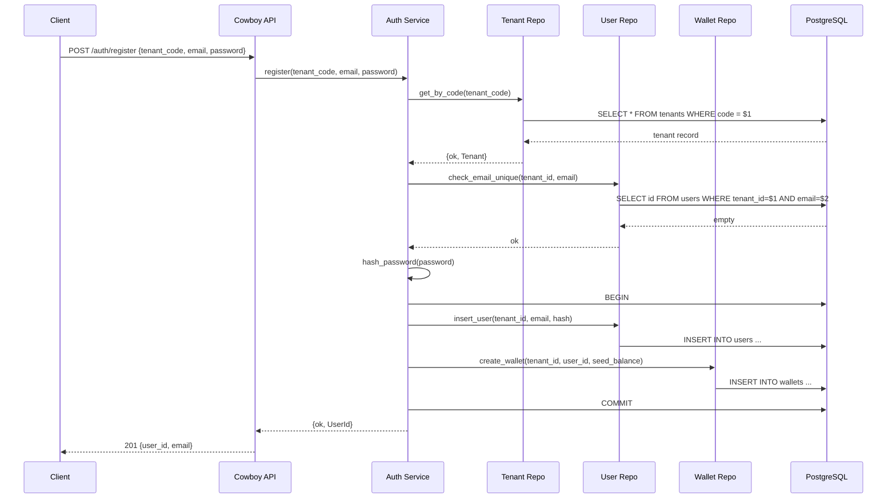
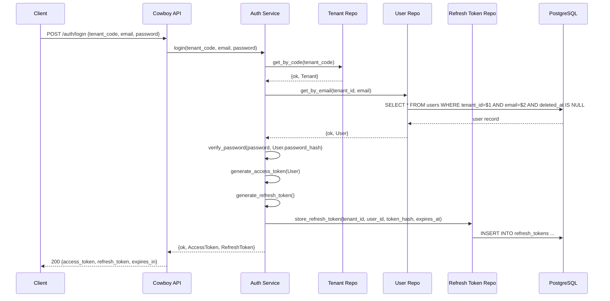
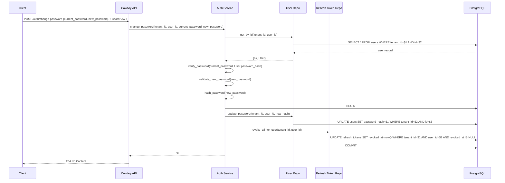
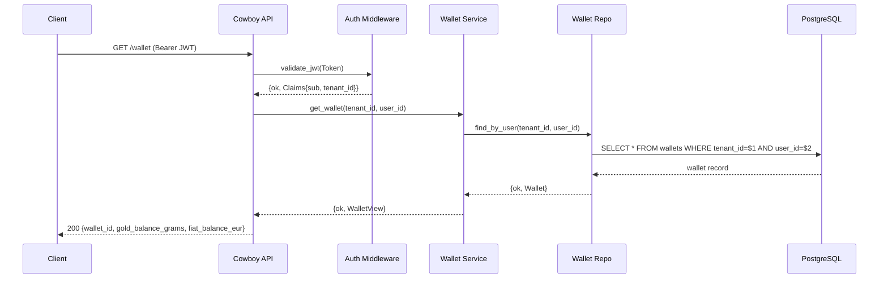
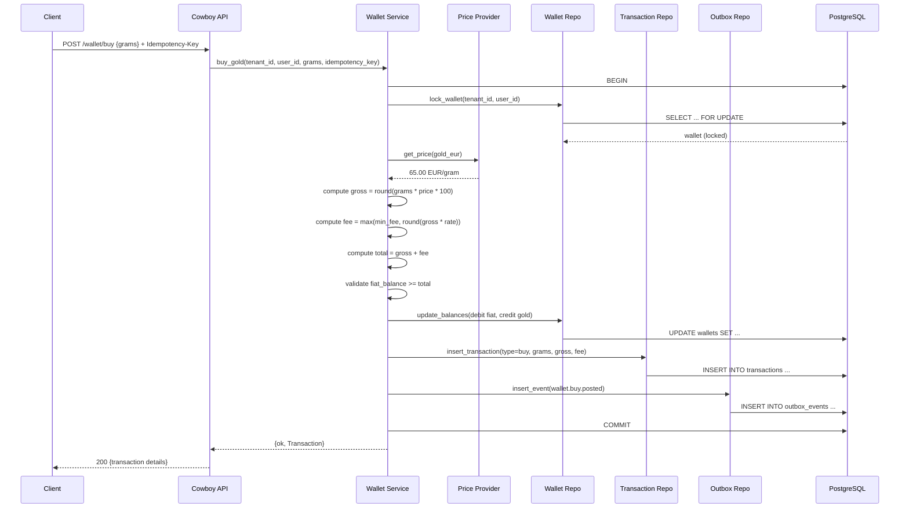
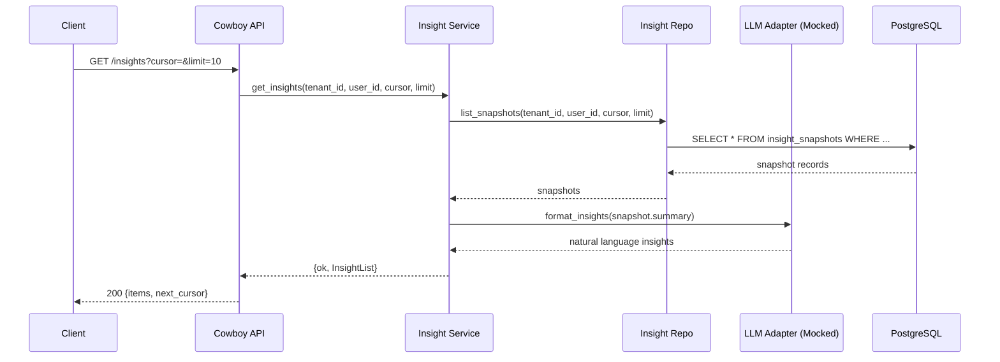
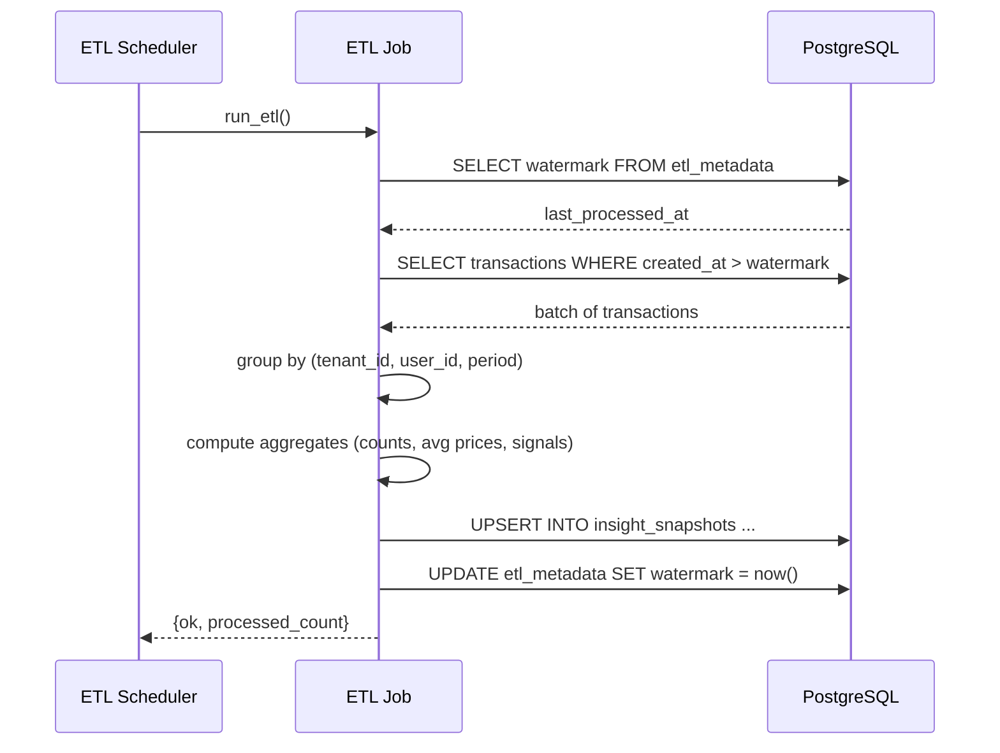

# Aurix — Use Cases

## Use Case Diagram

```mermaid
graph TB
    subgraph Actors
        V[👤 Visitor]
        U[👤 User]
        A[👤 Admin]
        S[⚙️ System]
    end

    subgraph "Authentication"
        UC1[UC-1: Register]
        UC2[UC-2: Login]
        UC3[UC-3: Refresh Token]
        UC4[UC-4: Logout]
        UC21[UC-21: Change Password]
    end

    subgraph "Wallet Operations"
        UC5[UC-5: View Wallet]
        UC6[UC-6: Buy Gold]
        UC7[UC-7: Sell Gold]
        UC8[UC-8: View Transactions]
    end

    subgraph "AI Insights"
        UC9[UC-9: View Insights]
    end

    subgraph "Admin Operations"
        UC10[UC-10: Seed Tenant]
        UC11[UC-11: Configure Fees]
        UC12[UC-12: Update Price]
        UC13[UC-13: Trigger ETL]
        UC14[UC-14: View Health]
        UC15[UC-15: Deactivate Tenant]
    end

    subgraph "System Automations"
        UC16[UC-16: Run ETL]
        UC17[UC-17: Dispatch Outbox]
        UC18[UC-18: Reconcile Balances]
    end

    subgraph "Privacy"
        UC19[UC-19: Export Data]
        UC20[UC-20: Request Erasure]
    end

    V --> UC1
    V --> UC2
    U --> UC3
    U --> UC4
    U --> UC21
    U --> UC5
    U --> UC6
    U --> UC7
    U --> UC8
    U --> UC9
    U --> UC19
    U --> UC20
    A --> UC10
    A --> UC11
    A --> UC12
    A --> UC13
    A --> UC14
    A --> UC15
    S --> UC16
    S --> UC17
    S --> UC18
```

---

## UC-1: Register

| Field | Detail |
|-------|--------|
| **Actor** | Visitor |
| **Precondition** | Tenant exists and is active |
| **Trigger** | Visitor submits registration form |
| **Description** | Create a new user account and wallet under a tenant |

### Main Flow

### Alternative Flows
- **A1**: Tenant not found → 400 `invalid_tenant`
- **A2**: Email already exists → 409 `email_taken`
- **A3**: Password validation fails → 400 `invalid_password`
- **A4**: Tenant is inactive → 403 `tenant_inactive`

---

## UC-2: Login

| Field | Detail |
|-------|--------|
| **Actor** | Visitor |
| **Precondition** | User exists, is active, and tenant is active |
| **Trigger** | User submits login credentials |

### Main Flow

### Alternative Flows
- **A1**: Tenant not found → 400 `invalid_tenant`
- **A2**: User not found → 401 `invalid_credentials`
- **A3**: Wrong password → 401 `invalid_credentials`
- **A4**: User soft-deleted → 403 `account_disabled`
- **A5**: Tenant inactive → 403 `tenant_inactive`

---

## UC-3: Refresh Token

| Field | Detail |
|-------|--------|
| **Actor** | User |
| **Precondition** | User has a valid refresh token |
| **Trigger** | Access token expired or near expiry |

### Main Flow

1. Client sends `POST /auth/refresh` with `refresh_token`
2. Server hashes the token and looks up the record
3. Validates: not expired, not revoked, user still active
4. Issues new access token
5. Optionally rotates refresh token (revoke old, issue new)
6. Returns new tokens

### Alternative Flows
- **A1**: Refresh token expired → 401 `token_expired`
- **A2**: Refresh token revoked → 401 `token_revoked`
- **A3**: User deleted/inactive → 403 `account_disabled`

---

## UC-4: Logout

| Field | Detail |
|-------|--------|
| **Actor** | User |
| **Precondition** | User is authenticated with a valid refresh token |
| **Trigger** | User chooses to log out |

### Main Flow

1. Client sends `POST /auth/logout` with `refresh_token`
2. Server revokes the refresh token (sets `revoked_at`)
3. Returns 204 No Content

---

## UC-21: Change Password

| Field | Detail |
|-------|--------|
| **Actor** | User (authenticated) |
| **Precondition** | JWT is valid and user is logged in |
| **Trigger** | User wants to change their password |

### Main Flow

### Alternative Flows
- **A1**: Current password wrong → 401 `invalid_credentials`
- **A2**: New password fails validation → 400 `invalid_password`
- **A3**: New password same as current → 400 `invalid_password`
- **A4**: JWT invalid or expired → 401 `unauthorized`

---

## UC-5: View Wallet

| Field | Detail |
|-------|--------|
| **Actor** | User (authenticated) |
| **Precondition** | JWT is valid and not expired |
| **Trigger** | User navigates to wallet view |

### Main Flow

---

## UC-6: Buy Gold

| Field | Detail |
|-------|--------|
| **Actor** | User (authenticated) |
| **Precondition** | Wallet exists, sufficient EUR balance |
| **Trigger** | User submits buy order |

### Main Flow

### Alternative Flows
- **A1**: Insufficient fiat balance → 422 `insufficient_balance`
- **A2**: Invalid grams (negative, zero, bad precision) → 400 `invalid_amount`
- **A3**: Duplicate idempotency key → 409 `duplicate_request`
- **A4**: Wallet not found → 404 `wallet_not_found`

---

## UC-7: Sell Gold

| Field | Detail |
|-------|--------|
| **Actor** | User (authenticated) |
| **Precondition** | Wallet exists, sufficient gold balance |
| **Trigger** | User submits sell order |

### Main Flow

Mirrors UC-6 with reversed balances:
1. Lock wallet
2. Get price
3. Compute gross = round(grams * price * 100)
4. Compute fee = max(min_fee, round(gross * rate))
5. Compute net credit = gross - fee
6. Validate gold_balance >= grams
7. Update wallet: debit gold, credit fiat with net amount
8. Insert transaction record
9. Insert outbox event
10. Commit

### Alternative Flows
- **A1**: Insufficient gold → 422 `insufficient_gold`
- **A2**: Invalid grams → 400 `invalid_amount`
- **A3**: Duplicate idempotency key → 409 `duplicate_request`

---

## UC-8: View Transactions

| Field | Detail |
|-------|--------|
| **Actor** | User (authenticated) |
| **Precondition** | JWT is valid |
| **Trigger** | User views transaction history |

### Main Flow

1. Client sends `GET /transactions?cursor=&limit=20`
2. Server queries transactions for (tenant_id, user_id) ordered by created_at DESC
3. Returns paginated list with `next_cursor`

---

## UC-9: View Insights

| Field | Detail |
|-------|--------|
| **Actor** | User (authenticated) |
| **Precondition** | ETL has generated insight snapshots |
| **Trigger** | User checks insights page |

### Main Flow

---

## UC-10: Seed Tenant (Admin)

| Field | Detail |
|-------|--------|
| **Actor** | Admin |
| **Precondition** | Admin has DB access |
| **Trigger** | New organization onboards |

### Main Flow

1. Admin runs seed SQL or admin script
2. Inserts tenant with unique code and name
3. Optionally configures fee schedule

---

## UC-11: Configure Fees (Admin)

| Field | Detail |
|-------|--------|
| **Actor** | Admin |
| **Precondition** | Tenant exists |
| **Trigger** | Admin adjusts pricing for a tenant |

### Main Flow

1. Admin updates fee configuration for the tenant
2. New rates apply to subsequent transactions
3. Change is logged for audit

---

## UC-12: Update Gold Price (Admin)

| Field | Detail |
|-------|--------|
| **Actor** | Admin |
| **Precondition** | Price provider is in fixed mode |
| **Trigger** | Market price changes |

### Main Flow

1. Admin updates price in application config or via admin endpoint
2. Price provider returns new value on next read
3. Change is logged

---

## UC-13: Trigger ETL (Admin)

| Field | Detail |
|-------|--------|
| **Actor** | Admin |
| **Precondition** | None |
| **Trigger** | Admin wants fresh insights |

### Main Flow

1. Admin triggers ETL via endpoint or CLI
2. ETL job runs extract → transform → load cycle
3. Returns count of processed records

---

## UC-14: Health Check

| Field | Detail |
|-------|--------|
| **Actor** | Admin / Load Balancer |
| **Precondition** | None |
| **Trigger** | Periodic health probe |

### Main Flow

1. `GET /health` checks DB connection, Redis connection, app status
2. Returns 200 if all healthy
3. Returns 503 with details if any component is degraded

---

## UC-15: Deactivate Tenant (Admin)

| Field | Detail |
|-------|--------|
| **Actor** | Admin |
| **Precondition** | Tenant exists and is active |
| **Trigger** | Admin decides to suspend a tenant |

### Main Flow

1. Admin sets tenant status to `inactive`
2. All login attempts for that tenant fail
3. Existing sessions expire naturally

---

## UC-16: Run Scheduled ETL (System)

| Field | Detail |
|-------|--------|
| **Actor** | System (timer-based) |
| **Precondition** | Transactions exist since last watermark |
| **Trigger** | Timer fires (hourly/daily) |

### Main Flow

---

## UC-17: Dispatch Outbox Events (System)

| Field | Detail |
|-------|--------|
| **Actor** | System (background process) |
| **Precondition** | Unpublished outbox events exist |
| **Trigger** | Polling interval |

### Main Flow

1. Dispatcher queries `outbox_events WHERE published_at IS NULL` (batch)
2. For each event, publishes to Kafka (or logs in demo mode)
3. Marks events as published
4. Retries on failure with backoff

---

## UC-18: Reconcile Wallet Balances (System)

| Field | Detail |
|-------|--------|
| **Actor** | System (scheduled job) |
| **Precondition** | None |
| **Trigger** | Daily schedule |

### Main Flow

1. For each wallet, compute expected balance from SUM of transactions
2. Compare to stored wallet balance
3. If mismatch detected, log alert (no auto-correction)
4. Admin reviews and resolves manually

---

## UC-19: Export Personal Data

| Field | Detail |
|-------|--------|
| **Actor** | User (authenticated) |
| **Precondition** | JWT is valid |
| **Trigger** | User requests data export |

### Main Flow

1. Client sends `GET /privacy/export`
2. Server gathers user profile, wallet, transactions, insights
3. Returns JSON export or initiates async generation with download link

---

## UC-20: Request Account Erasure

| Field | Detail |
|-------|--------|
| **Actor** | User (authenticated) |
| **Precondition** | JWT is valid |
| **Trigger** | User requests account deletion |

### Main Flow

1. Client sends `POST /privacy/erasure-request`
2. Server disables account immediately (set `deleted_at`)
3. Queues erasure workflow for non-essential data
4. Retains legally required records
5. Returns 202 Accepted with confirmation
